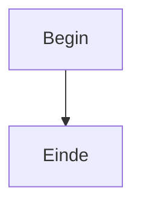
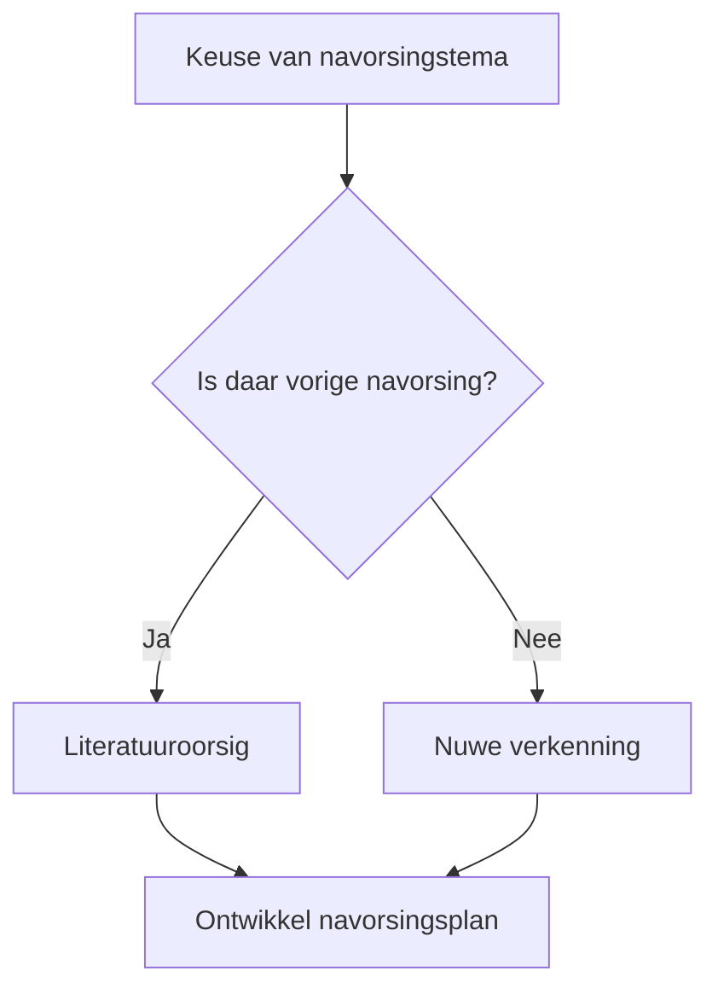
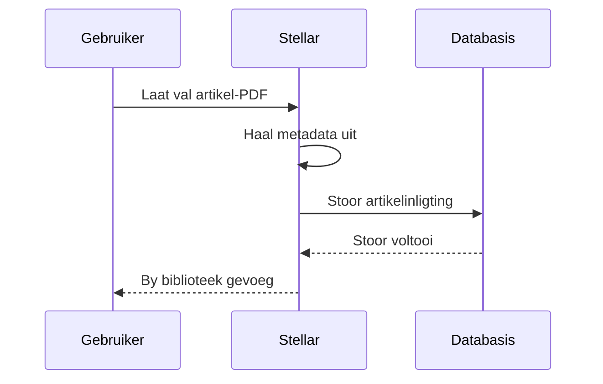
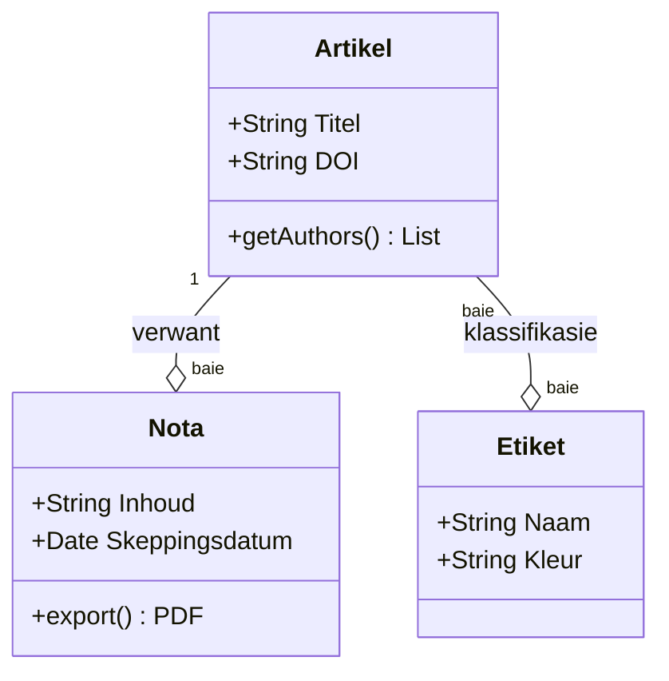
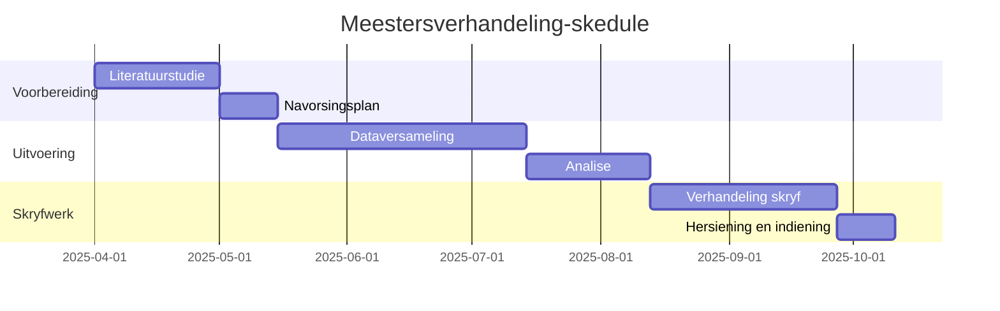
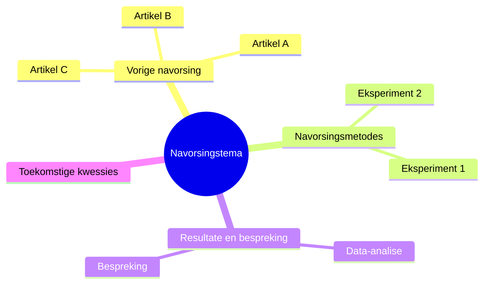
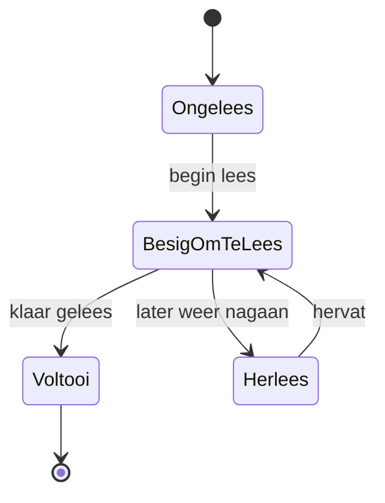
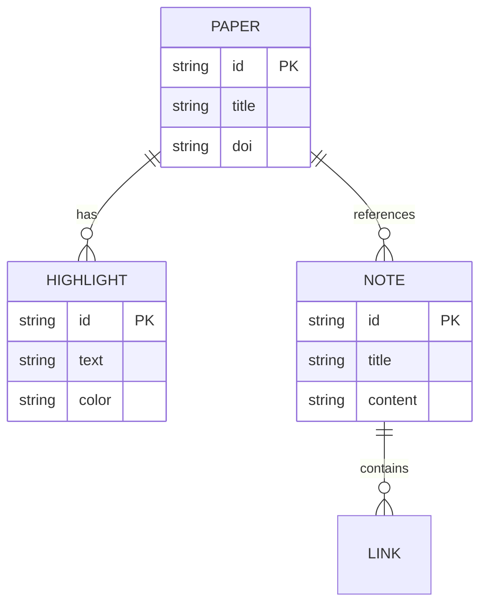
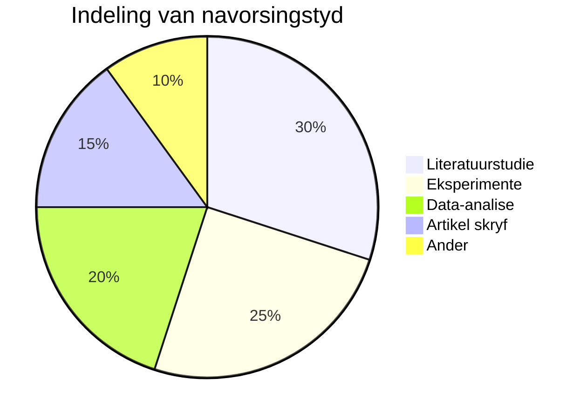

# Stellar-gebruikersgids

## Inleiding — Wat is Stellar?

**Stellar** is ’n **navorsingsondersteunende rekenaartoepassing** waarmee jy artikels en bronne kan lees, notas kan maak, en kennis kan organiseer.

Jy kan Stellar byvoorbeeld gebruik om:

- artikels wat jy gelees het op een plek te bestuur, soos ’n boekrak
- belangrike gedeeltes direk in PDF’s uit te lig en net die nodige dele uit te haal
- wat jy gelees het in notas saam te vat met die ingeboude Markdown-redigeerder
- die verbande tussen artikels en notas as ’n grafiek te visualiseer
- ingeboude hulpmiddels vir volwaardige navorsing te gebruik, insluitend kwalitatiewe en kwantitatiewe analise

Stellar ondersteun die hele proses van **navorsing doen en inligting organiseer**: van hoërskool-ondersoekprojekte tot universiteitsverslae, afstudeerverhandelinge, seminaaraanbiedings en meer.

---

## Inhoudsopgawe

1. [Eerste opstelling (aanboording)](#1-eerste-opstelling-aanboording)
2. [Verstaan die skermuitleg](#2-verstaan-die-skermuitleg)
3. [Literatuurbiblioteek — Versamel en bestuur artikels](#3-literatuurbiblioteek--versamel-en-bestuur-artikels)
4. [PDF-leser — Lees en lig artikels uit](#4-pdf-leser--lees-en-lig-artikels-uit)
5. [Notas — Organiseer jou gedagtes](#5-notas--organiseer-jou-gedagtes)
6. [Konsepmodus — Skryf verslae en artikels](#6-konsepmodus--skryf-verslae-en-artikels)
7. [Kennisgrafiek — Maak verbande sigbaar](#7-kennisgrafiek--maak-verbande-sigbaar)
8. [Globale soektog — Vind enigiets onmiddellik](#8-globale-soektog--vind-enigiets-onmiddellik)
9. [Kwalitatiewe analisehulpmiddels — Lees tekste in diepte](#9-kwalitatiewe-analisehulpmiddels--lees-tekste-in-diepte)
10. [Kwantitatiewe analisehulpmiddels (Data Studio) — Werk met getalle](#10-kwantitatiewe-analisehulpmiddels-data-studio--werk-met-getalle)
11. [Uitvoer en deel](#11-uitvoer-en-deel)
12. [Wolkrugsteun — Gemoedsrus selfs as jou rekenaar breek](#12-wolkrugsteun--gemoedsrus-selfs-as-jou-rekenaar-breek)
13. [Instellings — Pas Stellar by jou voorkeure aan](#13-instellings--pas-stellar-by-jou-voorkeure-aan)
14. [Sleutelbordkortpaaie](#14-sleutelbordkortpaaie)
15. [Woordelys](#15-woordelys)
16. [Probleemoplossing (FAQ)](#16-probleemoplossing-faq)

---

## 1. Eerste opstelling (aanboording)

Wanneer jy Stellar vir die eerste keer oopmaak, verskyn ’n **vyf-stap-opstellingskerm**.

| Stap | Item | Beskrywing |
|---------|------|------|
| 1 | Welkom | ’n Inleiding tot Stellar word gewys. Druk “Begin” om voort te gaan. |
| 2 | Taalkeuse | Kies uit Japannees, English, Français en Afrikaans. |
| 3 | Kies stoorplek | Kies die vouer waar jou data gestoor sal word. Die verstek is `~/Stellar`, direk onder jou tuisvouer. Jy kan dit net so laat. |
| 4 | Temakeuse | Kies die voorkoms, soos ligte of donker modus. Jy kan dit later verander, so kies wat jy verkies. |
| 5 | Voltooi | Die opstelling is klaar. Nuttige sleutelbordkortpaaie word bekendgestel. |

> **Wenk**: Die opstelling gebeur net een keer. Van die volgende keer af maak Stellar direk op die hoofskerm oop.

---

## 2. Verstaan die skermuitleg

Die Stellar-skerm is in **vier hoofareas** verdeel.

```
┌─────────────────────────────────────────────────┐
│                 Titelbalk                       │
├────────┬──────────────────────┬─────────────────┤
│        │                      │                 │
│ Sy-    │     Hoofpaneel        │   Konteks-      │
│ balk   │  (groot middelarea)   │   paneel        │
│        │                      │   (regs)        │
│        │                      │                 │
├────────┴──────────────────────┴─────────────────┤
│                 Statusbalk                      │
└─────────────────────────────────────────────────┘
```

### Sybalk (heel links)

Die sybalk bevat knoppies waarmee jy tussen skerms kan wissel. Van bo na onder:

| Ikoon | Naam | Funksie |
|---------|------|------|
| 📚 | Biblioteek | Wys die lys artikels |
| 📝 | Notas | Wys die lys notas |
| 🔗 | Grafiek | Visualiseer kennisverbande |
| 🔬 | Kwalitatiewe analise | Tekstanalisehulpmiddels |
| 📊 | Kwantitatiewe analise | Analisehulpmiddels vir numeriese data |
| ⚙️ | Instellings | Die instellingskerm van die toepassing |

> **Wenk**: Die sybalk kan ingevou word. Klik die knoppie links onder om na ’n kompakte vertoning met net ikone oor te skakel.

### Hoofpaneel (middel)

Dit is die hoofarea vir die skerm wat jy gekies het. Die artikellys, notaredigeerder, PDF-leser en ander hoofaansigte word hier gewys.

### Kontekspaneel (regs)

Die kontekspaneel wys besonderhede oor die item wat tans gekies is:

- Wanneer ’n artikel gekies is → etikette, metadata, lys uitliggings, verwante notas
- Wanneer ’n nota gekies is → terugskakels, etikette, inhoudsopgawe / uiteensetting

---

## 3. Literatuurbiblioteek — Versamel en bestuur artikels

### Hoe om die biblioteekskerm te lees

Die Biblioteek wys ’n lys van die artikels en bronne wat jy geregistreer het. Dink daaraan as jou boekrak.

Daar is twee **vertoonformate**:

- **Kaartaansig**: Artikels word as kaarte gerangskik, soos tydskrifvoorblaaie op ’n rak
- **Lysaansig**: Artikels word een per ry gewys, soos ’n Excel-tabel

Jy kan tussen die twee wissel met die knoppie regs bo.

### Voeg ’n artikel by

Druk die **“+ Voeg by”-knoppie** bo-aan die skerm om die byvoegvenster oop te maak. Daar is vier maniere om ’n artikel by te voeg.

#### Metode 1: Voeg vanaf PDF by (aanbeveel)

1. Kies die “PDF”-oortjie
2. Druk die “Kies PDF”-knoppie en kies ’n PDF-lêer op jou rekenaar
3. Stellar lees outomaties die titel, outeur, jaar en ander inligting uit die PDF
4. Gaan die inhoud na en klik “Stoor”

> **Punt**: Stellar haal inligting outomaties uit die PDF se metadata, dit wil sê inligting wat in die lêer ingebed is. As dit nie goed gelees kan word nie, kan jy dit met die hand regmaak.

#### Metode 2: Voeg vanaf URL by

1. Kies die “URL”-oortjie
2. Plak die URL van die artikel se webblad in
3. Druk die “Haal op”-knoppie om bibliografiese inligting outomaties uit die bladsy te haal
4. Gaan die inhoud na en klik “Stoor”

#### Metode 3: Voeg vanaf DOI by

1. Kies die “DOI”-oortjie
2. Voer die DOI in, byvoorbeeld `10.1000/xyz123`
3. Druk die “Haal op”-knoppie, en die bibliografiese inligting word outomaties ingevul
4. Gaan die inhoud na en klik “Stoor”

> **Wat is ’n DOI?** DOI staan vir Digital Object Identifier. Dit is ’n unieke ID waarmee ’n akademiese artikel wêreldwyd geïdentifiseer kan word. Dit word dikwels op die artikel se bladsy aangedui.

#### Metode 4: Handmatige invoer

1. Kies die “Handmatig”-oortjie
2. Voer die titel, outeur, publikasiejaar, tydskrifnaam en ander inligting direk in
3. Klik “Stoor”

### Soek en filtreer artikels

Bo-aan die Biblioteek is verskeie filters beskikbaar:

| Filter | Beskrywing |
|---------|------|
| Soekbalk | Soek vrylik volgens titel of outeurnaam |
| Etikette | Filter volgens etikette wat jy bygevoeg het, byvoorbeeld “masjienleer” of “sielkunde” |
| Publikasiejaar | Filter volgens jaar |
| PDF-beskikbaarheid | Wys net artikels waaraan ’n PDF geheg is |

### Bekyk artikelbesonderhede

Wanneer jy op ’n artikel in die lys klik, verskyn besonderhede in die kontekspaneel aan die regterkant:

- **Basiese inligting**: titel, outeur, jaar, tydskrifnaam, DOI, URL
- **Etikette**: klassifikasielabels wat jy vrylik kan byvoeg
- **Lys uitliggings**: die lys merkers wat jy in die PDF gemaak het
- **Verwante notas**: notas wat aan hierdie artikel gekoppel is
- **Aanhalingsnetwerk**: verwysings, aangehaalde bronne en aanbevole artikels vir hierdie artikel

### Heg ’n PDF aan ’n artikel

Jy kan ook later ’n PDF aan ’n artikel heg wat reeds geregistreer is. Druk die “Heg PDF aan”-knoppie op die artikel se besonderhedeskerm en kies die lêer.

### Redigeer of verwyder ’n artikel

- **Redigeer**: Gebruik die “Redigeer”-knoppie op die artikel se besonderhedeskerm om die titel, outeur en ander velde te verander
- **Verwyder**: Gebruik die “Verwyder”-knoppie om die artikel te verwyder; ’n bevestigingsvenster sal verskyn
- **Grootmaataksies**: Kies verskeie artikels met die merkblokkies en verwyder hulle saam

---

## 4. PDF-leser — Lees en lig artikels uit

### Maak ’n PDF oop

Dubbelklik op ’n artikel waaraan ’n PDF geheg is, of klik die leserikoon. Die **PDF-leser-skerm** sal oopmaak.

Die skerm is in twee dele verdeel:

- **Links**: die PDF-vertoonarea
- **Regs**: die paneel met die lys uitliggings

### Maak ’n uitligging (merker)

1. **Sleep met die muis** oor ’n belangrike sin of gedeelte in die PDF om dit te kies
2. ’n Nutsbalk verskyn. Kies die kleur wat jy wil hê en klik daarop
3. Die gekose gedeelte word uitgelig

**Vier kleure** is beskikbaar. Jy kan dit ook met die nommersleutels kies:

| Sleutel | Kleur | Voorbeeldgebruik |
|-----|-----|----------|
| 1 | 🟡 Geel | Belangrike gedeeltes |
| 2 | 🟢 Groen | Gedeeltes oor metodologie |
| 3 | 🔵 Blou | Gedeeltes wat met jou eie argument verband hou |
| 4 | 🔴 Rooi | Vrae of dele wat nagegaan moet word |

### Voeg kommentaar by ’n uitligging

In die lys uitliggings aan die regterkant kan jy kommentaar of memo’s by die gemerkte gedeelte skryf. As jy neerskryf waarom die gedeelte belangrik is, is dit later baie makliker om dit te hersien.

### Skep ’n nota uit uitliggings

1. Merk in die regterpaneel die uitliggings wat jy in ’n nota wil gebruik
2. Druk die “Skep nota uit seleksie”-knoppie
3. ’n Nuwe nota word geskep waarin die gekose uitliggings outomaties saamgevat is

> **Wenk**: Hiermee kan jy maklik ’n opsommingsnota van ’n artikel maak.

### PDF-bediening

| Aksie | Metode |
|-----|------|
| Zoem in | `Ctrl + +` |
| Zoem uit | `Ctrl + -` |
| Stel zoem terug | `Ctrl + 0` |
| Blaai tussen bladsye | `←` / `→`-sleutels, of rol |
| Soek teks | `Ctrl + F` |

---

## 5. Notas — Organiseer jou gedagtes

### Samestelling van die notaskerm

Wanneer jy “Notas” in die sybalk kies, verskyn die **notalys** links en die **notaredigeerder** regs.

### Skep ’n nota

Klik die **“+ Nuwe nota”-knoppie** bo die notalys om ’n nuwe nota te skep. Jy kan dit ook vinnig met die kortpad `Ctrl + N` doen.

### Skryf notas (hoe om die redigeerder te gebruik)

Stellar se redigeerder ondersteun **Markdown**. Dit is ’n skryfwyse waarmee jy opskrifte, vetdruk en ander formatering met eenvoudige tekens kan maak.

#### Markdown-kitsgids

| Skryfwyse | Vertoonresultaat | Betekenis |
|--------|---------|------|
| `# Titel` | **Groot opskrif** | Die grootste opskrif |
| `## Subopskrif` | **Middelopskrif** | Die tweede vlak opskrif |
| `### Kleiner opskrif` | **Klein opskrif** | Die derde vlak opskrif |
| `**Vetdruk**` | **Vetdruk** | Iets wat jy wil beklemtoon |
| `*Kursief*` | *Kursief* | Iets wat jy lig wil beklemtoon |
| `- Item 1` | • Item 1 | Kolpuntlys |
| `1. Stap 1` | 1. Stap 1 | Genommerde lys |
| `> Aanhaling` | > Aanhaling | Iemand anders se woorde aanhaal |
| `` `Kode` `` | `Kode` | Programkode en soortgelyke teks |
| `==Uitligging==` | Uitligging, soos met ’n merker | ’n Deel wat jy wil laat uitstaan |

#### WikiLink

As jy `[[Nota se titel]]` in ’n nota skryf, kan jy ’n skakel na ’n ander nota maak.

1. Tik `[[`, en ’n lys voorstelle verskyn
2. Kies die nota of artikel waarna jy wil skakel
3. Klik daarop om na daardie nota te spring

> **Waarom dit kragtig is**: Wanneer jy notas met WikiLink aan mekaar verbind, word die verbande in die **kennisgrafiek** gevisualiseer. Jou netwerk van kennis groei so al hoe verder.

#### Voeg ’n aanhaling in

As jy `@cite{artikelID}` in ’n nota skryf, kan jy ’n artikelverwysing invoeg. Stellar formateer dit outomaties volgens die gekose aanhalingstyl, soos APA of MLA.

#### Voeg ’n Mermaid-diagram in

As jy `mermaid` in ’n kodeblok spesifiseer, kan Stellar vloeidiagramme en ander diagramme outomaties uit teks genereer.

Stellar het ’n **Mermaid-diagram-skeppingsvenster** wat via die diagramikoon in die nutsbalk oopgemaak kan word. Jy kan ’n sjabloon kies en dit redigeer terwyl jy ’n lewendige voorskou sien. Jy kan natuurlik ook Mermaid-notasie direk in die redigeerder skryf.

##### Basiese skryfwyse

Skryf die volgende kodeblok in ’n nota, en die diagram word outomaties geteken:

````

````

##### Ondersteunde diagramtipes en voorbeelde

Stellar ondersteun die volgende **8 soorte** diagramme.

---

**1. Vloeidiagram (Flowchart)** — stel prosesse en vertakkings voor

````

````

Rigtingspesifikasie: `TD` (bo na onder), `LR` (links na regs), `BT` (onder na bo), `RL` (regs na links)

Nodusse se vorme:

| Notasie | Vorm |
|------|------|
| `A[Teks]` | Reghoek |
| `A{Teks}` | Diamant / besluit |
| `A(Teks)` | Reghoek met afgeronde hoeke |
| `A((Teks))` | Sirkel |
| `A>Teks]` | Vlagvorm |

Pylsoorte: `-->` soliede pyl, `-.->` stippellynpyl, `==>` dik pyl, `--teks-->` pyl met etiket

---

**2. Volgordediagram (Sequence Diagram)** — stel interaksies in tydsvolgorde voor

````

````

Pylsoorte: `->>` solied, `-->>` stippellyn, `-x` mislukking, `-)` asinkroon

---

**3. Klasdiagram (Class Diagram)** — organiseer datastrukture en begripsverhoudings

````

````

---

**4. Gantt-grafiek (Gantt Chart)** — bestuur skedules en navorsingsplanne

````

````

---

**5. Kopkaart (Mindmap)** — organiseer idees en temas

````

````

---

**6. Toestanddiagram (State Diagram)** — stel veranderinge in prosesstatus voor

````

````

---

**7. ER-diagram (Entity Relationship Diagram)** — stel dataverhoudings voor

````

````

Verhoudingsnotasie: `||--||` een-tot-een, `||--o{` een-tot-baie, `}o--o{` baie-tot-baie

---

**8. Sirkelgrafiek (Pie Chart)** — visualiseer dataverhoudings

````

````

---

##### Wenke vir gebruik

- Met die **skeppingsvenster** kan jy by ’n sjabloon begin, dus hoef jy nie die notasie uit jou kop te ken nie
- As daar ’n fout in die diagramkode is, word ’n foutboodskap vertoon. Maak regstellings terwyl jy die voorskou nagaan
- Raadpleeg die [amptelike Mermaid-dokumentasie](https://mermaid.js.org/intro/) vir gedetailleerde notasie

### Notanutsbalk

Bo-aan die redigeerder is ’n nutsbalk met die volgende funksies:

| Knoppie | Funksie |
|--------|------|
| Titel | Klik om te redigeer |
| 🔍 Soek | Soek teks binne die nota |
| 🎯 Fokusmodus | Skakel oor na ’n afleidingsarme modus met net die redigeerder |
| 📋 Kieslys | Voer uit na PDF/DOCX, verwyder, voer as statiese webwerf uit, ensovoorts |

### Outomatiese stoor

Notas word **outomaties gestoor**. Die statusbalk onderaan die skerm wys die stoorstatus:

- ⏳ Stoor tans…
- ✅ Gestoor; die laaste stoortyd word ook gewys

### Sorteer en soek notas

In die notalys kan jy die volgende doen:

- **Soek**: filter volgens notatitel
- **Sorteer**: volgens datum bygewerk / datum geskep / titel, met stygende of dalende volgorde

### Koppel artikels en notas

As jy ’n nota aan ’n artikel koppel wanneer jy dit skep, word dit as ’n nota oor daardie artikel bestuur. Dit verskyn in die artikel se besonderhedespaneel onder “verwante notas”.

---

## 6. Konsepmodus — Skryf verslae en artikels

### Wat is konsepmodus?

Konsepmodus is ’n spesiale redigeermodus wat handig is wanneer jy langer tekste skryf, soos verslae of akademiese artikels.

In konsepmodus gebruik Stellar ’n **tweekolomuitleg**:

```
┌────────────────────────────┬──────────┐
│                            │ Aanhaling │
│        Redigeerder          │  paneel   │
│                            │          │
│                            │(verwysing-│
│                            │  lys)     │
└────────────────────────────┴──────────┘
```

### Regterpaneel: aanhalings / konteks

Daar is twee oortjies:

- **Aanhaling-oortjie**: lys van artikels wat jy aangehaal het en instellings vir die aanhalingstyl
- **Konteks-oortjie**: verwante inligting soos terugskakels en etikette

### Kies ’n aanhalingstyl

Jy kan die aanhalingstyl uit die keuselys regs bo kies:

| Styl | Beskrywing | Waar dit gebruik word |
|---------|------|------------|
| APA 7th | Styl van die American Psychological Association | Sielkunde, opvoedkunde, sosiale wetenskappe |
| MLA 9th | Styl van die Modern Language Association | Letterkunde, taalkunde, geesteswetenskappe |
| Chicago 17th | Styl van die University of Chicago | Geskiedenis, kunsgeskiedenis |
| Hitotsubashi-styl | Styl wat by Japannese universiteite gebruik word | Japannese sosiale wetenskappe |

---

## 7. Kennisgrafiek — Maak verbande sigbaar

### Hoe om die grafiekskerm te lees

Wanneer jy “Grafiek” in die sybalk kies, verskyn die **kennisgrafiek**.

Dit is ’n funksie wat die verbande tussen jou artikels en notas as ’n **netwerkdiagram** visualiseer.

- **Ronde punte (nodusse)**: elke punt verteenwoordig een artikel of nota
- **Lyne (skakels)**: die lyne verteenwoordig verbande tussen artikels en notas

### Soorte nodusse

| Soort | Voorkoms | Inhoud |
|------|--------|------|
| Artikel | Ronde punt in een kleur | Artikels wat in die Biblioteek geregistreer is |
| Nota | Ronde punt in ’n ander kleur | Notas wat jy geskep het |

### Grafiekbediening

| Aksie | Metode |
|------|------|
| Beweeg | Sleep |
| Zoem | Rol |
| Sien nodusinligting | Hou die muis oor ’n nodus; ’n opspringvenster verskyn |
| Kies ’n nodus | Klik |
| Maak ’n nota of artikel oop | Dubbelklik |
| Ontkies | Klik die agtergrond, of druk `Esc` |
| Keer terug na volle aansig | `Ctrl + 0` |

### Filterpaneel (regs bo)

Jy kan beperk watter nodusse gewys word:

- Nodussoort: slegs artikels / slegs notas / albei
- Filter volgens etikette

### Legende-paneel (links onder)

Hier word die huidige aantal nodusse en skakels gewys, asook wat die kleure beteken. Daar is ook ’n “volle aansig”-knoppie.

### Minikaart (regs onder)

Die minikaart wys die hele grafiek in klein formaat. As jy daarop klik, skuif die hoofgrafiek na daardie plek.

---

## 8. Globale soektog — Vind enigiets onmiddellik

Druk **`Ctrl + K`** op Windows/Linux, of **`Cmd + K`** op Mac, om die **globale soekvenster** in die middel van die skerm oop te maak.

### Waarin kan jy soek?

- Artikeltitels en outeurname
- Notatitels en notatekste
- Uitliggings, dit wil sê die teks wat jy in PDF’s gemerk het

### Hoe om dit te gebruik

1. Maak die soekvenster met `Ctrl + K` oop
2. Tik ’n soekwoord in; voorstelle verskyn intyds
3. Gebruik die oortjies om te filter: alles / artikels / notas / uitliggings
4. Beweeg deur die voorstelle met `↑` en `↓`, en druk `Enter` om oop te maak
5. Druk `Esc` om toe te maak

> **Wenk**: Die soektog ondersteun voltekssoek. Dit vind ook inhoud wat jy binne notas geskryf het.

---

## 9. Kwalitatiewe analisehulpmiddels — Lees tekste in diepte

### Wat is kwalitatiewe analise?

Kwalitatiewe analise is ’n metode om teks soos onderhoudrekords of bronne sistematies te klassifiseer en te ontleed. Dit word dikwels in sosiologie, sielkunde, opvoedkunde en verwante velde gebruik.

### Skep ’n projek

1. Kies “Kwalitatiewe analise” in die sybalk
2. Skep ’n projek met die “+ Nuwe projek”-knoppie
3. Stel die projeknaam en analisemethode in, byvoorbeeld tematiese analise

### Die 11 analise-oortjies

Die kwalitatiewe analise-aansig het die volgende oortjies:

| Oortjie | Naam | Inhoud |
|------|------|------|
| 1 | Kontroleskerm | Wys ’n oorsig van die projek |
| 2 | Kodeboek | Ken “kodes” of etikette aan teks toe en klassifiseer dit |
| 3 | Koderingsmatriks | Kruistabel van kodes en data |
| 4 | ICR (interbeoordelaarbetroubaarheid) | Bereken hoe sterk verskeie mense se analiseresultate ooreenstem |
| 5 | Bronkritiek | Vorm om die betroubaarheid van bronne te evalueer |
| 6 | Tydlyn | Rangskik gebeure in tydsvolgorde |
| 7 | Akteurkaart | Visualiseer verhoudings tussen betrokke persone of groepe |
| 8 | Prosesnasporing | Volg die proses van oorsaaklike verhoudings |
| 9 | Vergelykende ontwerp | Vergelykende analise van gevalle |
| 10 | Raamwerk-analise | Ontleed die “rame” of interpretasiekaders in media en soortgelyke tekste |
| 11 | Analiseverslag | Genereer ’n verslag van die analiseresultate |

> **Nota vir hoërskoolgebruikers**: Jy hoef nie alles dadelik te gebruik nie. Vir ondersoekprojekte is dit dikwels die beste om met “Kodeboek” en “Tydlyn” te begin.

---

## 10. Kwantitatiewe analisehulpmiddels (Data Studio) — Werk met getalle

### Wat is Data Studio?

Data Studio is ’n funksie waarmee jy opname-uitslae en numeriese data kan invoer en statisties kan ontleed.

### Skermuitleg

Die lys datastelle verskyn aan die linkerkant, en die inhoud wat deur oortjies gewissel word verskyn aan die regterkant.

### Vier oortjies

| Oortjie | Naam | Inhoud |
|------|------|------|
| 1 | Invoer | Lees data uit ’n CSV-lêer in |
| 2 | Veranderlikedefinisie | Stel die veranderlikenaam en tipe vir elke kolom in, soos numeries of kategories |
| 3 | Datavoorskou | Gaan die ingeleesde data in tabelvorm na |
| 4 | Analise | Voer statistiese analise uit |

### Hoe om data in te voer

1. Kies die “Invoer”-oortjie
2. Kies ’n CSV-lêer, dit wil sê ’n kommageskeide tekslêer wat byvoorbeeld uit Excel uitgevoer is
3. Die data word ingelees

### Soorte analise

In die analise-oortjie kan jy die volgende tipes analise uitvoer:

| Analisemetode | Inhoud | Voorbeeldgebruik |
|---------|------|----------|
| Beskrywende statistiek | Gemiddelde, mediaan, standaardafwyking, ensovoorts | Basiese opsomming van opname-uitslae |
| Inferensiële statistiek | t-toets, chi-kwadraattoets, ensovoorts | Toets verskille tussen groepe |
| Opname-analise | Analise wat spesifiek vir opnames nuttig is | Opsomming van Likert-skale |
| Teksanalise | Statistiese verwerking van teksdata | Analise van oop antwoorde |
| Netwerkanalise | Analise van verhoudingsdata | Medevoorkomsnetwerke, ensovoorts |

---

## 11. Uitvoer en deel

### Voer data uit

Op die “Data”-oortjie in die instellingskerm kan jy al jou data uitvoer:

- **JSON-uitvoer**: laai al jou artikels en notas in JSON-formaat af
- **Skep rugsteun**: stoor ’n rugsteunlêer met al jou data, insluitend artikels, notas, uitliggings en skakels

### Navorsingspakket (.stellar-lêer)

Hierdie funksie laat jou ’n hele navorsingsprojek as ’n pakket uitvoer en invoer.

**Uitvoer**:

1. Instellingskerm → Data-oortjie → “Navorsingspakket”-afdeling
2. Kies watter artikels en notas ingesluit moet word
3. Kies of PDF’s ingesluit moet word
4. Kies die stoorplek en voer uit

**Invoer**:

1. Kies die `.stellar`-lêer
2. Die inhoud van die pakket word gewys
3. Kies hoe konflikte hanteer moet word, byvoorbeeld wanneer data met dieselfde ID reeds bestaan
4. Voer die invoer uit

> **Voorbeeldgebruik**: Dit is handig wanneer jy ’n artikellys en notas saam met lede van ’n navorsingsgroep wil deel.

### Voer notas uit

Vanuit die kieslys in die notaredigeerder kan jy notas in die volgende formate uitvoer:

| Formaat | Beskrywing |
|------|------|
| PDF | Skakel om na ’n PDF-lêer vir drukwerk |
| DOCX | Skakel om na Microsoft Word-formaat |
| Statiese webwerf | Voer uit as ’n HTML-webwerf |

### Statiese webwerf-uitvoer

Dit is ’n funksie waarmee jy gekose notas as ’n webwerf kan uitvoer:

1. Kies die notas wat uitgevoer moet word
2. Stel die titel van die webwerf in
3. Kies ’n tema, lig of donker
4. Kies of terugskakels ingesluit moet word
5. Kies die uitvoervouer en genereer die webwerf

---

## 12. Wolkrugsteun — Gemoedsrus selfs as jou rekenaar breek

### Wat is wolkrugsteun?

Wolkrugsteun is ’n funksie wat al die data wat in Stellar gestoor is — artikels, notas, uitliggings en skakels — **geënkripteer en outomaties in die wolk stoor**.

Selfs as jou rekenaar breek of jy ’n nuwe een koop, kan jy jou data volledig op die nuwe rekenaar herstel, solank jy jou **12-syfer-herstelkode** het.

### Wat maak dit besonders?

| Gewone rugsteun | Stellar se wolkrugsteun |
|---|---|
| Rekeningregistrasie is nodig | **Nie nodig nie** — druk net ’n knoppie |
| ’n Wagwoord moet ingestel word | **Nie nodig nie** — ’n kode word outomaties gegenereer |
| Jy moet self ’n rugsteunbestemming kies | **Nie nodig nie** — dit word outomaties in die wolk gestoor |
| Herstel vereis ingewikkelde stappe | **Tik net die 12-syfer-kode in** |

> **Veiligheid**: Jou data word op jou rekenaar geënkripteer voordat dit gestuur word (AES-256-GCM). Die bediener kan nie die inhoud van jou data sien nie.

### Eerste opstelling (net een keer)

1. Maak die **instellingskerm** oop met die ⚙️ in die sybalk of `Ctrl + ,`
2. Kies die **“Data”-oortjie**
3. Rol af en vind die **“Wolkrugsteun”**-afdeling
4. Druk die **“Aktiveer wolkrugsteun”**-knoppie
5. ’n **Herstelkode** in die vorm `XXXX-XXXX-XXXX` word gewys

> **⚠️ Baie belangrik**: Hou die herstelkode wat gewys word **altyd op ’n veilige plek**!
> - Skryf dit op papier en hou dit in jou beursie
> - Stoor dit in ’n nota-toepassing op jou slimfoon
> - Registreer dit in ’n wagwoordbestuurder
>
> As jy hierdie kode verloor, kan jy jou data nie herstel wanneer jou rekenaar breek nie.

### Maak ’n rugsteun

#### Handmatige rugsteun

1. Instellingskerm → Data-oortjie → Wolkrugsteun-afdeling
2. Druk die **“Rugsteun nou”**-knoppie
3. Die rugsteun word binne ’n paar sekondes tot ’n paar tientalle sekondes voltooi
4. Wanneer dit klaar is, verskyn “Wolkrugsteun voltooi”

#### Outomatiese rugsteun (aanbeveel)

As jy die **“Outomatiese rugsteun”**-skakelaar aansit, word ’n rugsteun outomaties gemaak elke keer wanneer Stellar begin. Dan hoef jy nie te onthou om dit self te doen nie.

### Gaan rugsteungeskiedenis na

Onder in die Wolkrugsteun-afdeling verskyn **“Rugsteungeskiedenis”**:

- **Datum en tyd**: wanneer die rugsteun gemaak is
- **Aantal data-items**: hoeveel artikels, notas, uitliggings en skakels daarin is
- **Grootte**: die grootte van die rugsteunlêer
- **“Herstel”-knoppie**: herstel vanaf daardie rugsteun

### My rekenaar het gebreek! Herstel data

Nadat jy Stellar op ’n nuwe rekenaar geïnstalleer het, kan jy jou data soos volg herstel:

1. Maak Instellingskerm → Data-oortjie oop
2. Vind die **“Herstel met herstelkode”**-afdeling
3. Tik die **12-syfer-herstelkode** in wat jy veilig gehou het, byvoorbeeld `XXXX-XXXX-XXXX`
4. Druk die **“Herstel”**-knoppie
5. ’n Lys rugsteune word gewys
6. Druk die **“Herstel”**-knoppie vir die rugsteun wat jy wil gebruik
7. Jou data word herstel

> **Gerusstellende punt**: Herstel werk deur saamvoeging. As jy reeds nuwe data op die nuwe rekenaar gemaak het, word dit nie oorskryf nie. Net nuwe data uit die rugsteun word bygevoeg.

### Bekyk en kopieer die herstelkode

As wolkrugsteun reeds opgestel is, kan jy die herstelkode in die instellingskerm nagaan:

1. Instellingskerm → Data-oortjie → Wolkrugsteun-afdeling
2. Die herstelkode word **vervaag** gewys ter wille van sekuriteit
3. Druk die **“Wys”**-knoppie om die kode sigbaar te maak
4. Druk die **“Kopieer”**-knoppie om dit na die knipbord te kopieer

### Wanneer daar geen netwerkverbinding is nie

Selfs as jy nie aan die internet gekoppel is nie, word rugsteundata outomaties in geënkripteerde vorm in ’n plaaslike vouer op jou rekenaar gestoor: `~/.stellar/cloud_backups/`. Wanneer jy weer met die internet verbind, word dit na die wolk opgelaai.

---

## 13. Instellings — Pas Stellar by jou voorkeure aan

Jy kan die instellingskerm oopmaak met die ⚙️-ikoon in die sybalk of met `Ctrl + ,`.

### Voorkoms-oortjie

| Item | Beskrywing |
|------|------|
| Tema | Verander die kleurskema van die hele skerm, soos lig, donker en ander temas |
| Lettergrootte | Die grootte van teks, van 13px tot 16px |
| Lynhoogte | Die spasiëring tussen reëls, van 1.5 tot 2.0 |
| Redigeerderlettertipe | Die lettertipe wat in die notaredigeerder gebruik word |

### Data-oortjie

| Item | Beskrywing |
|------|------|
| Dataopsomming | Aantal artikels, notas en uitliggings, en skyfgebruik |
| Stoorplekpad | Gaan die datavouer na of verander dit |
| Uitvoer | Voer al jou data as JSON uit |
| Plaaslike rugsteun | Skep ’n rugsteun van al jou data en stoor dit op jou rekenaar |
| Navorsingspakket | Voer uit of voer in in `.stellar`-formaat |
| Blaaierkoppeling | Gaan die status van Stellar Clipper, die blaaieruitbreiding, na |
| **Wolkrugsteun** | **Opstelling, uitvoering, geskiedenis en herstel van geënkripteerde wolkrugsteun; sien [hoofstuk 12](#12-wolkrugsteun--gemoedsrus-selfs-as-jou-rekenaar-breek) vir besonderhede** |

### Kortpaaie-oortjie

’n Lys van alle sleutelbordkortpaaie word per kategorie vertoon.

### Aanhalingstyl-oortjie

| Item | Beskrywing |
|------|------|
| Verstek aanhalingstyl | Kies uit APA 7th / MLA 9th / Chicago 17th / Hitotsubashi-styl |
| Volgorde van outeurname | Kies van → voornaam of voornaam → van |

### Taal-oortjie

Verander die vertoontaal. Ondersteunde tale:

- 🇯🇵 日本語
- 🇬🇧 English
- 🇫🇷 Français
- 🇿🇦 Afrikaans

---

## 14. Sleutelbordkortpaaie

As jy die kortpaaie leer wat jy gereeld gebruik, word jou werk baie vinniger.

### Navigasie (tussen skerms beweeg)

| Kortpad | Funksie |
|---------------|------|
| `Ctrl + K` | Maak globale soektog oop |
| `Ctrl + N` | Skep ’n nuwe nota |
| `Ctrl + ,` | Maak die instellingskerm oop |
| `Ctrl + 1` | Skakel na die Biblioteek |
| `Ctrl + 2` | Skakel na die notalys |
| `Ctrl + 3` | Skakel na die Grafiek |
| `Ctrl + [` | Gaan terug |
| `Ctrl + ]` | Gaan vorentoe |

### Redigeerder (wanneer notas geredigeer word)

| Kortpad | Funksie |
|---------------|------|
| `Ctrl + S` | Stoor |
| `Ctrl + B` | Vetdruk |
| `Ctrl + I` | Kursief |
| `Ctrl + Z` | Ontdoen |
| `Ctrl + Shift + Z` | Herdoen |
| `[[` | Begin ’n WikiLink, oftewel skakel-invoeging |

### PDF-leser

| Kortpad | Funksie |
|---------------|------|
| `Ctrl + +` | Zoem in |
| `Ctrl + -` | Zoem uit |
| `Ctrl + 0` | Stel zoem terug |
| `Ctrl + F` | Soek binne die PDF |
| `1` / `2` / `3` / `4` | Kies uitligkleur |

### Grafiek

| Kortpad | Funksie |
|---------------|------|
| Rol | Zoem |
| Sleep | Beweeg die grafiek |
| Dubbelklik | Maak ’n nodus oop |
| `Esc` | Ontkies |
| `Ctrl + 0` | Volle aansig |

> **Vir Mac-gebruikers**: Lees `Ctrl` as `Cmd` (⌘).

---

## 15. Woordelys

Hier is terme wat moontlik vir die eerste keer verskyn.

| Term | Betekenis |
|------|------|
| **Markdown** | ’n Skryfwyse wat formatering met tekens maak, soos `# Opskrif` en `**Vetdruk**`. Dit word dikwels deur programmeerders en skrywers gebruik. |
| **DOI** | Soos die “adres” van ’n akademiese artikel. Dit is ’n ID waarmee een artikel wêreldwyd geïdentifiseer kan word. |
| **WikiLink** | ’n Stelsel waarmee jy ’n skakel na ’n ander nota maak deur `[[notanaam]]` te skryf. Dit werk soos ’n wiki. |
| **Terugskakel** | ’n Terugwaartse skakel wat wys uit watter notas ’n bepaalde nota geskakel word. |
| **Kennisgrafiek** | ’n Funksie wat die verbande tussen notas en artikels as ’n netwerkdiagram wys. |
| **Uitligging** | ’n Fluoresserende merker wat jy in ’n PDF maak. Die teks en posisie-inligting word gestoor. |
| **Etiket** | ’n Klassifikasielabel wat jy aan artikels of notas heg, byvoorbeeld “sielkunde” of “gebruik in hoofstuk 3”. |
| **Aanhalingstyl** | Reëls vir die formaat van verwysingslyste. Voorbeelde is APA en MLA. |
| **Kwalitatiewe analise** | ’n Metode om “woorddata”, soos teks en beelde, sistematies te ontleed. |
| **Kwantitatiewe analise** | ’n Metode om numeriese data statisties te ontleed. |
| **CSV** | Comma Separated Values. ’n Teksformaat waarin data deur kommas geskei word. Dit kan ook uit Excel uitgevoer word. |
| **Konsep** | ’n Onvoltooide weergawe van ’n teks. In konsepmodus kan jy hoofstukstruktuur en aanhalings bestuur. |
| **Mermaid** | ’n Stelsel wat diagramme soos vloeidiagramme outomaties uit teks genereer. |
| **Navorsingspakket** | ’n Pakket waarin artikels, notas en uitliggings saam as ’n `.stellar`-lêer uitgevoer word. |
| **Wolkrugsteun** | ’n Funksie wat data geënkripteer in die wolk stoor. Selfs as jou rekenaar breek, kan jy dit met ’n herstelkode terugkry. |
| **Herstelkode** | ’n 12-syfer-kode in die vorm `XXXX-XXXX-XXXX` waarmee jy wolkrugsteun kan herstel. Dit word outomaties per rekenaar gegenereer. |
| **E2E-enkripsie** | End-to-End-enkripsie. Data word voor versending geënkripteer, sodat die bediener nie die inhoud kan sien nie. |

---

## 16. Probleemoplossing (FAQ)

### V: Ek probeer ’n artikel byvoeg, maar die titel kan nie uit die PDF gelees word nie

**A**: Die PDF se metadata, dit wil sê die inligting wat in die lêer ingebed is, kan onvoldoende wees. In so ’n geval probeer Stellar die titel uit die lêernaam raai, maar dit is die betroubaarste om dit met die hand reg te maak.

### V: Dit voel asof outomatiese stoor van notas nie reg werk nie

**A**: Gaan die statusbalk onderaan die skerm na. As “Gestoor” verskyn, is alles reg. Nadat jy vir ’n paar sekondes opgehou tik het, word die nota outomaties gestoor.

### V: Niks verskyn in die grafiek nie

**A**: Die grafiek wys net **nodusse met skakels**. Probeer die volgende:

1. Skryf ’n WikiLink soos `[[ander notanaam]]` in ’n nota
2. Koppel ’n nota aan ’n artikel
3. Gaan na of ’n filter ingestel is; probeer die “Stel filters terug”-knoppie

### V: Ek is bekommerd dat my data kan verdwyn

**A**: Die beste aanbeveling is om **wolkrugsteun** te aktiveer.

1. Instellingskerm → Data-oortjie → druk “Aktiveer wolkrugsteun”
2. Hou die herstelkode wat vertoon word op ’n veilige plek
3. Skakel “Outomatiese rugsteun” aan

Net hiermee kan jy jou data herstel, selfs as jou rekenaar breek. Sien [12. Wolkrugsteun](#12-wolkrugsteun--gemoedsrus-selfs-as-jou-rekenaar-breek) vir besonderhede.

Daar is ook die volgende maatreëls:

- Instellingskerm → Data-oortjie → gebruik “Skep rugsteun” om gereeld plaaslike rugsteune te maak
- Voer data met die “Navorsingspakket”-funksie as ’n `.stellar`-lêer uit

### V: Ek het my wolkrugsteun-herstelkode verloor

**A**: As wolkrugsteun reeds opgestel is, kan jy dit nagaan by Instellingskerm → Data-oortjie → Wolkrugsteun-afdeling. Druk die “Wys”-knoppie om die vervaging te verwyder en die kode te sien. Jy kan dit ook met die “Kopieer”-knoppie kopieer.

As jou rekenaar egter reeds gebreek het en jy nie die kode ken nie, kan wolkrugsteun ongelukkig nie herstel word nie. Hou die kode altyd ook op ’n ander plek, soos op papier, op jou slimfoon of in ’n wagwoordbestuurder.

### V: Is wolkrugsteun veilig? Sal my data uitlek?

**A**: Dit is veilig. Jou data word op jou rekenaar met **AES-256-GCM**, ’n baie sterk metode, geënkripteer voordat dit na die bediener gestuur word. Die bediener het nie die sleutel om die data te ontsluit nie, dus kan selfs die bedieneradministrateur nie die inhoud van jou data sien nie. Dit is E2E-enkripsie.

### V: Kan ek rugsteun wanneer ek nie met die internet verbind is nie?

**A**: Ja. Wanneer jy vanlyn is, word ’n geënkripteerde rugsteun outomaties op jou rekenaar gestoor in `~/.stellar/cloud_backups/`. Wanneer jy weer met die internet verbind, word dit ook na die wolk gesinkroniseer.

### V: Ek het die taal verander, maar sommige dele verander nie

**A**: Taalveranderings word byna onmiddellik weerspieël, maar as sommige dele nie verander nie, herbegin die toepassing.

### V: Die blaaieruitbreiding, Stellar Clipper, bly op “wag”

**A**: Stellar Clipper werk wanneer die rekenaartoepassing aan die gang is. Gaan die volgende na:

1. Is die Stellar-rekenaartoepassing oop?
2. Is die blaaieruitbreiding geïnstalleer?
3. Gaan Instellings → Data-oortjie → “Installasie-instruksies” na

### V: Kwalitatiewe en kwantitatiewe analise lyk moeilik…

**A**: Jy hoef dit nie dadelik te gebruik nie. Die basiese kern van Stellar is **“artikelbestuur” + “notas” + “grafiek”**. Begin met die analisehulpmiddels bietjie vir bietjie wanneer jy dit nodig kry.

---

## Ten slotte

Stellar is ’n toepassing wat die hele navorsingsiklus van **“lees → dink → skryf → verbind”** ondersteun.

Begin deur artikels te registreer en PDF’s te lees. Wanneer jy gewoond raak daaraan, kan jy notas maak, dit met WikiLink verbind, en jou manier van gebruik stap vir stap uitbrei.

Hoe meer jy dit gebruik, hoe meer groei jou netwerk van kennis.

**Goeie navorsing!** ✨
