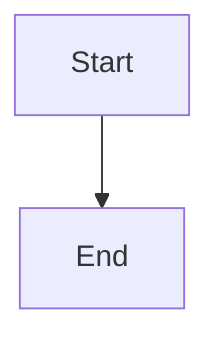
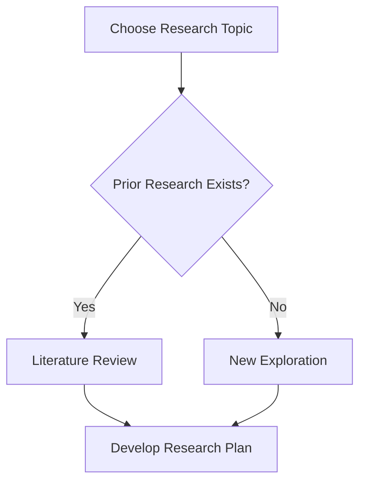
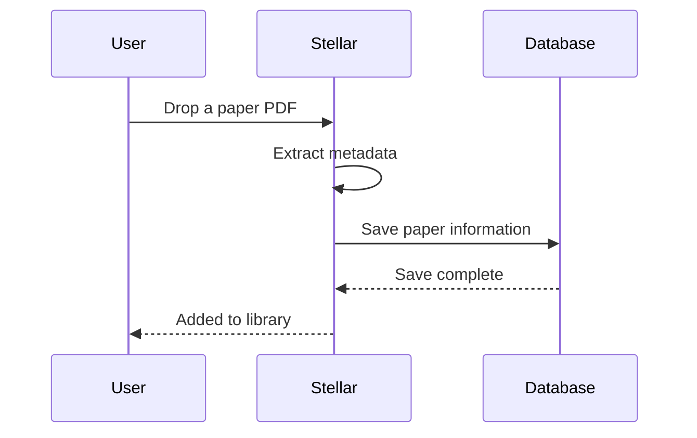
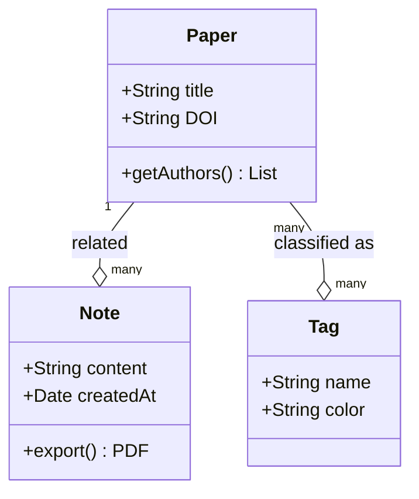
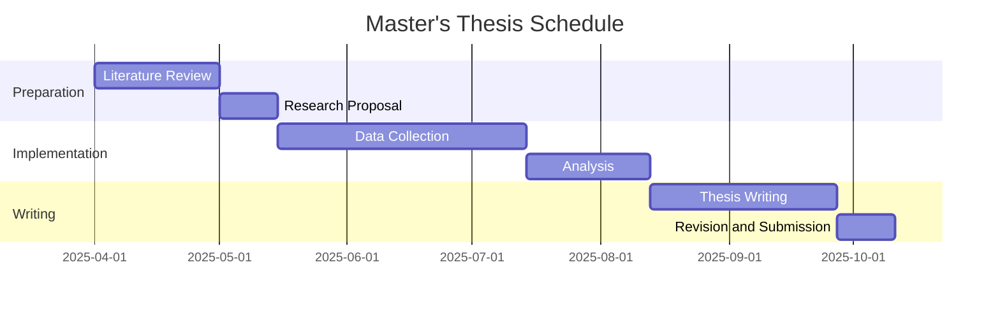
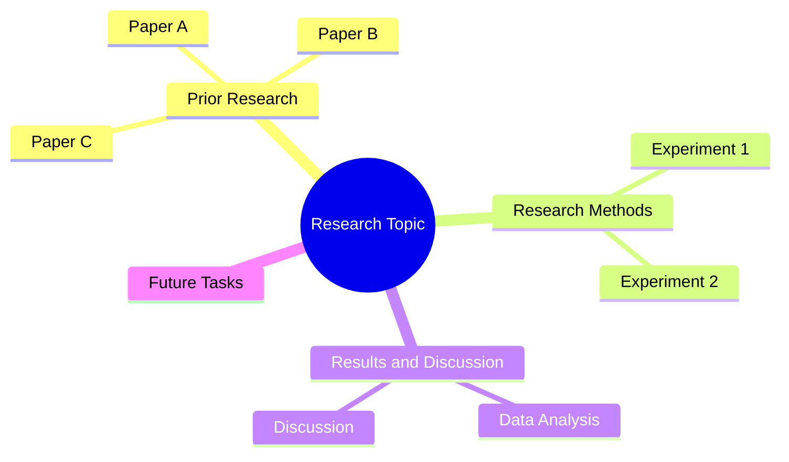
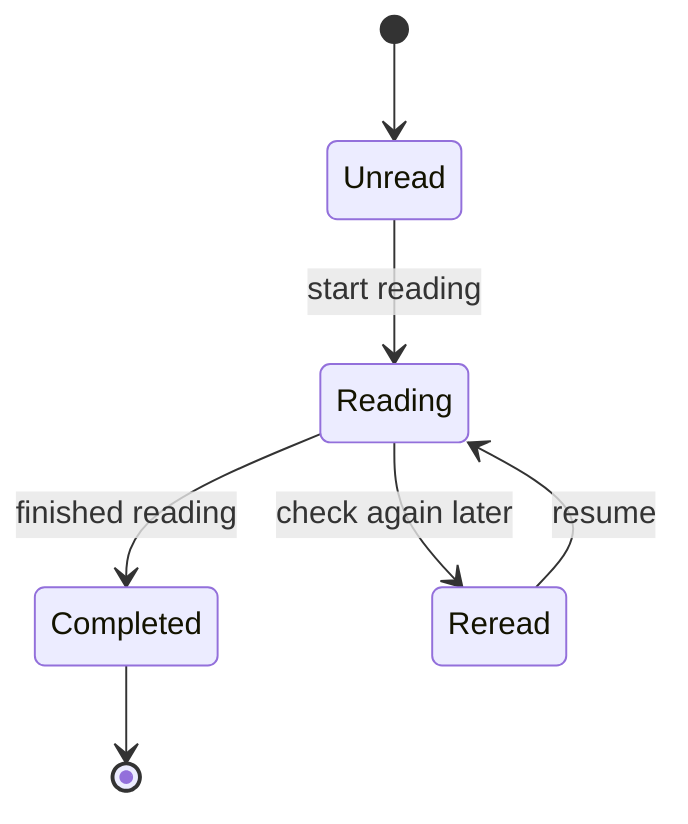
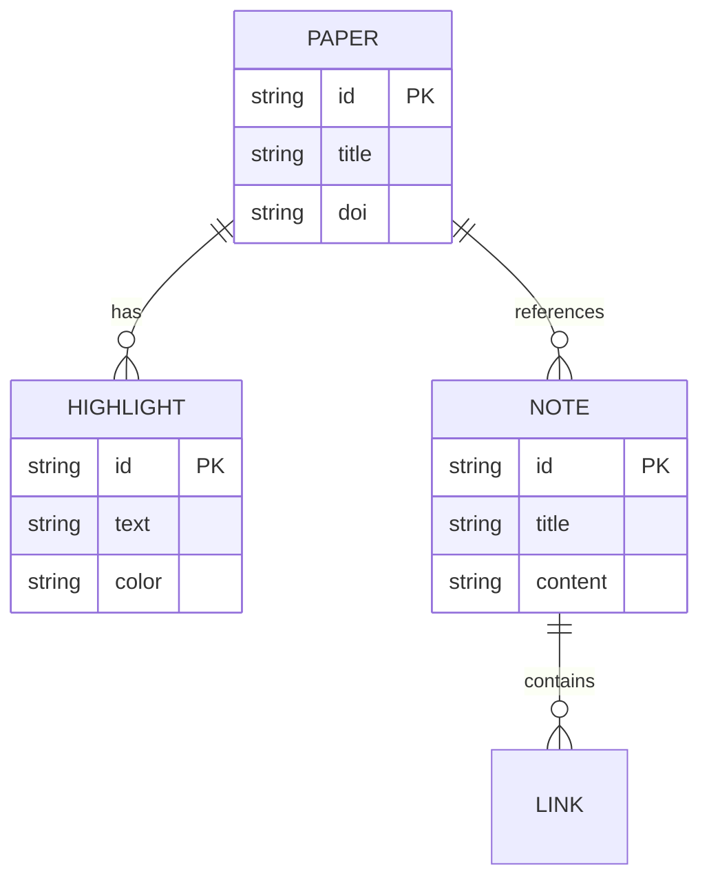
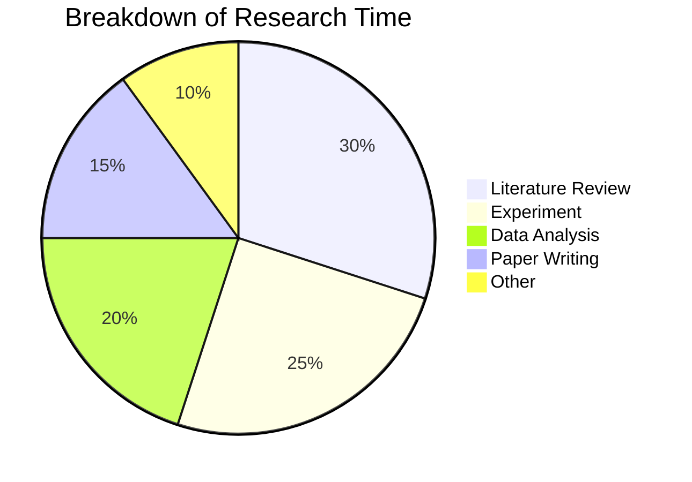

# Stellar User Guide

## Introduction — What is Stellar?

**Stellar** is a **research-support desktop app** for reading papers and sources, taking notes, and organizing knowledge.

For example, you can use Stellar to:

- Manage the papers you have read in one place, like a bookshelf
- Highlight important passages directly in PDFs and extract only the parts you need
- Summarize what you have read in notes, using the built-in Markdown editor
- Visualize connections between papers and notes as a graph
- Use built-in tools for serious research work, including qualitative and quantitative analysis

Stellar supports the whole process of **researching and organizing information**, from high school inquiry projects to university reports, graduation theses, seminar presentations, and beyond.

---

## Table of Contents

1. [Initial Setup (Onboarding)](#1-initial-setup-onboarding)
2. [Understanding the Screen Layout](#2-understanding-the-screen-layout)
3. [Literature Library — Collect and Manage Papers](#3-literature-library--collect-and-manage-papers)
4. [PDF Reader — Read and Highlight Papers](#4-pdf-reader--read-and-highlight-papers)
5. [Notes — Organize Your Thoughts](#5-notes--organize-your-thoughts)
6. [Draft Mode — Write Reports and Papers](#6-draft-mode--write-reports-and-papers)
7. [Knowledge Graph — Visualize Connections](#7-knowledge-graph--visualize-connections)
8. [Global Search — Find Anything Instantly](#8-global-search--find-anything-instantly)
9. [Qualitative Analysis Tools — Read Texts in Depth](#9-qualitative-analysis-tools--read-texts-in-depth)
10. [Quantitative Analysis Tools (Data Studio) — Work with Numbers](#10-quantitative-analysis-tools-data-studio--work-with-numbers)
11. [Export and Sharing](#11-export-and-sharing)
12. [Cloud Backup — Peace of Mind Even If Your PC Breaks](#12-cloud-backup--peace-of-mind-even-if-your-pc-breaks)
13. [Settings — Customize Stellar to Your Preferences](#13-settings--customize-stellar-to-your-preferences)
14. [Keyboard Shortcuts](#14-keyboard-shortcuts)
15. [Glossary](#15-glossary)
16. [Troubleshooting (FAQ)](#16-troubleshooting-faq)

---

## 1. Initial Setup (Onboarding)

When you launch Stellar for the first time, a **five-step setup screen** appears.

| Step | Item | Description |
|---------|------|------|
| 1 | Welcome | An introduction to Stellar is displayed. Press “Get Started” to continue. |
| 2 | Language Selection | Choose from Japanese, English, Français, and Afrikaans. |
| 3 | Choose Storage Location | Select the folder where your data will be stored. The default is `~/Stellar`, directly under your home folder. Keeping the default is fine. |
| 4 | Theme Selection | Choose the appearance, such as light or dark mode. You can change this later, so choose whichever you prefer. |
| 5 | Complete | Setup is complete. Useful keyboard shortcuts are introduced. |

> **Tip**: Setup only happens once. From the next launch onward, Stellar opens directly to the main screen.

---

## 2. Understanding the Screen Layout

The Stellar screen is divided into **four main areas**.

```
┌─────────────────────────────────────────────────┐
│                 Title Bar                       │
├────────┬──────────────────────┬─────────────────┤
│        │                      │                 │
│ Side   │     Main Pane         │   Context       │
│ Bar    │  (large center area)  │   Panel         │
│        │                      │   (right)       │
│        │                      │                 │
├────────┴──────────────────────┴─────────────────┤
│                 Status Bar                      │
└─────────────────────────────────────────────────┘
```

### Sidebar (Far Left)

The sidebar contains buttons for switching between screens. From top to bottom:

| Icon | Name | Function |
|---------|------|------|
| 📚 | Library | Shows the list of papers |
| 📝 | Notes | Shows the list of notes |
| 🔗 | Graph | Visualizes knowledge connections |
| 🔬 | Qualitative Analysis | Text analysis tools |
| 📊 | Quantitative Analysis | Numerical data analysis tools |
| ⚙️ | Settings | App settings screen |

> **Tip**: The sidebar can be collapsed. Click the button in the lower left to switch to a compact icon-only display.

### Main Pane (Center)

This is the main area for the selected screen. It displays the paper list, note editor, PDF reader, and other main views.

### Context Panel (Right)

The context panel shows detailed information about the currently selected item:

- When a paper is selected → tags, metadata, highlight list, related notes
- When a note is selected → backlinks, tags, table of contents / outline

---

## 3. Literature Library — Collect and Manage Papers

### How to Read the Library Screen

The Library displays a list of the papers and sources you have registered. Think of it as your bookshelf.

There are two **display formats**:

- **Card View**: Papers are arranged as cards, like magazine covers lined up on a shelf
- **List View**: Papers are shown one per row, like an Excel table

You can switch between them using the button in the upper right.

### Adding a Paper

Press the **“+ Add” button** at the top of the screen to open the add modal. There are four ways to add a paper.

#### Method 1: Add from PDF (Recommended)

1. Select the “PDF” tab
2. Press “Select PDF” and choose a PDF file on your computer
3. Stellar automatically reads information such as title, author, and year from the PDF
4. Check the details and press “Save”

> **Point**: Stellar extracts information from the PDF metadata embedded in the file. If the extraction is inaccurate, you can edit the information manually.

#### Method 2: Add from URL

1. Select the “URL” tab
2. Paste the URL of the paper’s web page
3. Press “Fetch” to automatically extract bibliographic information from the page
4. Check the details and press “Save”

#### Method 3: Add from DOI

1. Select the “DOI” tab
2. Enter the DOI, for example `10.1000/xyz123`
3. Press “Fetch” to automatically fill in the bibliographic information
4. Check the details and press “Save”

> **What is a DOI?** DOI stands for Digital Object Identifier. It is an ID that uniquely identifies a paper worldwide. It is often written on the paper’s web page.

#### Method 4: Manual Entry

1. Select the “Manual Entry” tab
2. Enter the title, author, publication year, journal name, and other details directly
3. Press “Save”

### Searching and Filtering Papers

At the top of the Library, several filters are available.

| Filter | Description |
|---------|------|
| Search Bar | Search freely by title or author name |
| Tags | Filter by tags you have added, such as “machine learning” or “psychology” |
| Publication Year | Filter by year |
| PDF Availability | Show only papers with attached PDFs |

### Viewing Paper Details

Click a paper in the list to show its details in the context panel on the right.

- **Basic Information**: title, author, year, journal name, DOI, URL
- **Tags**: labels for classification, which you can add freely
- **Highlight List**: a list of highlights you made in the PDF
- **Related Notes**: a list of notes linked to the paper
- **Citation Network**: references, citing works, and recommended papers related to this paper

### Attaching a PDF to a Paper

You can also attach a PDF later to a paper that has already been registered. From the paper details screen, press “Attach PDF” and choose the file.

### Editing and Deleting Papers

- **Edit**: Use the “Edit” button in the paper details screen to revise the title, author, and other information
- **Delete**: Use the “Delete” button to delete a paper. A confirmation dialog will appear
- **Bulk Actions**: Select multiple papers using checkboxes and delete them together

---

## 4. PDF Reader — Read and Highlight Papers

### Opening a PDF

Double-click a paper with an attached PDF, or click the reader icon, to open the **PDF Reader screen**.

The screen is divided into two sides:

- **Left side**: PDF display area
- **Right side**: highlight list panel

### Creating Highlights

1. **Drag with the mouse** to select an important passage in the PDF
2. A toolbar appears. Choose a color and click it
3. The selected passage is highlighted

There are **four available colors**, which can also be selected with number keys.

| Key | Color | Example Use |
|-----|-----|----------|
| 1 | 🟡 Yellow | Important passages |
| 2 | 🟢 Green | Methodology-related passages |
| 3 | 🔵 Blue | Passages related to your own argument |
| 4 | 🔴 Red | Questions or points to verify |

### Adding Comments to Highlights

In the highlight list on the right, you can add comments or notes to highlighted passages. Writing why a passage matters makes it easier to review later.

### Creating Notes from Highlights

1. In the right panel, check the highlights you want to use in a note
2. Press “Create Note from Selection”
3. A new note is created automatically with the selected highlights collected together

> **Tip**: This makes it easy to create summary notes for papers.

### PDF Controls

| Action | Method |
|-----|------|
| Zoom In | `Ctrl + +` |
| Zoom Out | `Ctrl + -` |
| Reset Zoom | `Ctrl + 0` |
| Move Between Pages | `←` / `→` keys, or scroll |
| Search Text | `Ctrl + F` |

---

## 5. Notes — Organize Your Thoughts

### Note Screen Layout

Select “Notes” in the sidebar. The **note list** appears on the left, and the **note editor** appears on the right.

### Creating a Note

Click the **“+ New Note” button** above the note list to create a new note.
You can also create one immediately with the `Ctrl + N` shortcut.

### Writing Notes: How to Use the Editor

Stellar’s editor supports **Markdown**, a writing format that uses simple symbols to create headings, bold text, and other formatting.

#### Markdown Quick Reference

| Syntax | Display Result | Meaning |
|--------|---------|------|
| `# Title` | **Large Heading** | The largest heading |
| `## Subheading` | **Medium Heading** | A second-level heading |
| `### Smaller Heading` | **Small Heading** | A third-level heading |
| `**Bold**` | **Bold** | Text you want to emphasize |
| `*Italic*` | *Italic* | Slight emphasis |
| `- Item 1` | • Item 1 | Bullet list |
| `1. Step 1` | 1. Step 1 | Numbered list |
| `> Quotation` | > Quotation | Quoting someone’s words |
| `` `code` `` | `code` | Program code or similar text |
| `==Highlight==` | Highlight, marker-style | Text you want to make stand out |

#### WikiLinks

Write `[[Note Title]]` inside a note to create a link to another note.

1. Type `[[` to display a list of candidates
2. Select the note or paper you want to link
3. Click the link to jump to that note

> **This is powerful**: When you connect notes with WikiLinks, the connections are visualized in the **Knowledge Graph**, described later. Your knowledge network gradually expands.

#### Inserting Citations

Write `@cite{paperID}` inside a note to insert a paper citation. Stellar automatically formats it according to the selected citation style, such as APA or MLA.

#### Inserting Mermaid Diagrams

Specify `mermaid` inside a code block to automatically generate flowcharts and diagrams from text.

Stellar includes a **Mermaid diagram creation modal**, accessible from the diagram icon in the toolbar. You can choose a template and edit it while viewing a live preview. You can also write Mermaid syntax directly in the editor.

##### Basic Syntax

Write a code block like the following inside a note, and Stellar will automatically render it as a diagram.

````

````

##### Supported Diagram Types and Samples

Stellar supports the following **eight types** of diagrams.

---

**1. Flowchart** — Represents processes and branches

````

````

Direction options: `TD` (top to bottom), `LR` (left to right), `BT` (bottom to top), `RL` (right to left)

Node shapes:

| Syntax | Shape |
|------|------|
| `A[Text]` | Rectangle |
| `A{Text}` | Diamond / decision |
| `A(Text)` | Rounded rectangle |
| `A((Text))` | Circle |
| `A>Text]` | Flag shape |

Arrow types: `-->` solid arrow, `-.->` dotted arrow, `==>` thick arrow, `--Text-->` arrow with label

---

**2. Sequence Diagram** — Represents exchanges over time

````

````

Arrow types: `->>` solid, `-->>` dotted, `-x` failure, `-)` asynchronous

---

**3. Class Diagram** — Organizes relationships among data structures and concepts

````

````

---

**4. Gantt Chart** — Manages schedules and research plans

````

````

---

**5. Mind Map** — Organizes ideas and themes

````

````

---

**6. State Diagram** — Represents changes in process states

````

````

---

**7. Entity Relationship Diagram** — Represents relationships among data

````

````

Relationship notation: `||--||` one-to-one, `||--o{` one-to-many, `}o--o{` many-to-many

---

**8. Pie Chart** — Visualizes proportions in data

````

````

---

##### Tips for Better Use

- Use the **creation modal** to start from templates, so you do not need to memorize the syntax
- If the diagram code is incorrect, an error will be displayed. Check the preview while making corrections
- For detailed syntax, see the [official Mermaid documentation](https://mermaid.js.org/intro/)

### Note Toolbar

The toolbar at the top of the editor provides the following functions.

| Button | Function |
|--------|------|
| Title | Click to edit |
| 🔍 Search | Search text inside the note |
| 🎯 Focus Mode | Switch to a distraction-free editor-only mode |
| 📋 Menu | Export as PDF/DOCX, delete, export as static site, and more |

### Auto-Save

Notes are **saved automatically**. The save status is shown in the status bar at the bottom of the screen.

- ⏳ Saving…
- ✅ Saved, with the last saved time shown

### Sorting and Searching Notes

In the note list, you can do the following.

- **Search**: Filter by note title
- **Sort**: Sort by updated date, created date, or title; ascending and descending order can be toggled

### Linking Papers and Notes

When creating a note, you can link it to a paper. The note will then be managed as a note related to that paper. It will appear in the paper details panel under “Related Notes.”

---

## 6. Draft Mode — Write Reports and Papers

### What is Draft Mode?

Draft Mode is a special editor mode useful for writing longer texts than ordinary notes, such as reports and essays.

Draft Mode uses a **two-column layout**.

```
┌────────────────────────────┬──────────┐
│                            │ Citation │
│         Main Editor         │  Panel   │
│                            │          │
│                            │ Reference│
│                            │  List    │
└────────────────────────────┴──────────┘
```

### Right Panel: Citations / Context

There are two tabs.

- **Citation Tab**: List of cited papers and citation style settings
- **Context Tab**: Related information such as backlinks and tags

### Choosing a Citation Style

Use the dropdown in the upper right to choose a citation style.

| Style | Description | Common Use |
|---------|------|------------|
| APA 7th | American Psychological Association style | Psychology, education, social sciences |
| MLA 9th | Modern Language Association style | Literature, linguistics, humanities |
| Chicago 17th | University of Chicago style | History, art history |
| Hitotsubashi Style | A style used at Japanese universities | Japanese social sciences |

---

## 7. Knowledge Graph — Visualize Connections

### How to Read the Graph Screen

Select “Graph” in the sidebar to display the **Knowledge Graph**.

This feature visually shows the connections between your papers and notes as a **network diagram**.

- **Round points (nodes)**: Each represents one paper or note
- **Lines (links)**: Represent connections between papers and notes

### Node Types

| Type | Appearance | Meaning |
|------|--------|------|
| Paper | A colored circle | A paper registered in the Library |
| Note | A circle in another color | A note you created |

### Graph Controls

| Action | Method |
|------|------|
| Move | Drag |
| Zoom | Scroll |
| View node information | Hover over a node to show a popup |
| Select a node | Click |
| Open a note or paper | Double-click |
| Clear selection | Click the background, or press `Esc` |
| Return to full view | `Ctrl + 0` |

### Filter Panel (Upper Right)

You can filter which nodes are displayed.

- Node type: papers only / notes only / both
- Filter by tag

### Legend Panel (Lower Left)

This panel shows the current number of nodes and links, as well as the meaning of each color. It also includes a “Fit View” button.

### Minimap (Lower Right)

The minimap is a small panel that shows the whole graph. Click an area to move the main graph there.

---

## 8. Global Search — Find Anything Instantly

Press **`Ctrl + K`** (Mac: `Cmd + K`) to open the **Global Search modal** in the center of the screen.

### What You Can Search

- Paper titles and author names
- Note titles and bodies
- Highlight text from PDF markers

### How to Use It

1. Open the search modal with `Ctrl + K`
2. Enter a search term. Suggestions appear in real time
3. Filter by tab: all / papers / notes / highlights
4. Move through candidates with the `↑` and `↓` keys, and press `Enter` to open one
5. Press `Esc` to close the modal

> **Tip**: Search supports full text. Content written inside your notes will also be found.

---

## 9. Qualitative Analysis Tools — Read Texts in Depth

### What is Qualitative Analysis?

Qualitative analysis is a method for systematically classifying and analyzing text, such as interview transcripts or source materials. It is often used in sociology, psychology, education, and related fields.

### Creating a Project

1. Select “Qualitative Analysis” in the sidebar
2. Create a project with the “+ New Project” button
3. Set the project name and analysis method, such as thematic analysis

### The 11 Analysis Tabs

The qualitative analysis view includes the following tabs.

| Tab | Name | Content |
|------|------|------|
| 1 | Dashboard | Shows an overview of the project |
| 2 | Codebook | Add codes, or labels, to text for classification |
| 3 | Coding Matrix | A cross-table of codes and data |
| 4 | ICR (Inter-Coder Reliability) | Calculates agreement among multiple coders’ analyses |
| 5 | Source Criticism | A form for evaluating the reliability of sources |
| 6 | Timeline | Organizes events chronologically |
| 7 | Actor Map | Visualizes relationships among actors |
| 8 | Process Tracing | Tracks causal processes |
| 9 | Comparative Design | Comparative analysis of cases |
| 10 | Framing Analysis | Analyzes frames, such as those used in media |
| 11 | Analysis Report | Generates a report of analysis results |

> **Note for high school students**: You do not need to use everything at once. For inquiry projects, starting with the “Codebook” and “Timeline” tabs is recommended.

---

## 10. Quantitative Analysis Tools (Data Studio) — Work with Numbers

### What is Data Studio?

Data Studio is a feature for importing survey results and numerical data, then analyzing them statistically.

### Screen Layout

The dataset list appears on the left, and tab-based content appears on the right.

### The Four Tabs

| Tab | Name | Content |
|------|------|------|
| 1 | Import | Load data from a CSV file |
| 2 | Variable Definition | Set variable names and types for each column, such as numeric or categorical |
| 3 | Data Preview | Check imported data in table format |
| 4 | Analysis | Run statistical analyses |

### How to Import Data

1. Select the “Import” tab
2. Choose a CSV file, which is a comma-separated text file exported from Excel or similar software
3. The data is loaded

### Types of Analysis

In the Analysis tab, you can run analyses such as the following.

| Analysis Method | Description | Example Use |
|---------|------|----------|
| Descriptive Statistics | Mean, median, standard deviation, and similar values | Basic summary of survey results |
| Inferential Statistics | t-tests, chi-square tests, and similar methods | Testing differences between groups |
| Survey Analysis | Analysis specific to surveys | Aggregating Likert-scale responses |
| Text Analysis | Statistical processing of text data | Analysis of open-ended responses |
| Network Analysis | Analysis of relationship data | Co-occurrence networks and similar structures |

---

## 11. Export and Sharing

### Exporting Data

From the “Data” tab in Settings, you can export all data.

- **JSON Export**: Download all papers and notes in JSON format
- **Create Backup**: Save a backup file containing all data, including papers, notes, highlights, and links

### Research Package (.stellar File)

This feature lets you export and import an entire research project as a package.

**Export**:

1. Go to Settings → Data tab → “Research Package” section
2. Select the papers and notes to include
3. Choose whether to include PDFs
4. Select a save location and export

**Import**:

1. Select a `.stellar` file
2. The package contents are displayed
3. Choose how to handle conflicts, such as when data with the same ID already exists
4. Run the import

> **Example use**: This is useful when sharing a paper list and notes with members of a research group.

### Exporting Notes

From the note editor menu, you can export notes in the following formats.

| Format | Description |
|------|------|
| PDF | Convert to a print-ready PDF file |
| DOCX | Convert to Microsoft Word format |
| Static Site | Export as an HTML website |

### Static Site Export

This feature exports selected notes as a website.

1. Select the notes to export
2. Set the site title
3. Choose a theme, light or dark
4. Choose whether to include backlinks
5. Select the output folder and generate the site

---

## 12. Cloud Backup — Peace of Mind Even If Your PC Breaks

### What is Cloud Backup?

Cloud Backup is a feature that **encrypts and automatically saves** all data stored in Stellar, including papers, notes, highlights, and links, to the cloud.

Even if your computer breaks or you replace it, you can fully restore your data on a new PC as long as you have the **12-digit recovery code**.

### What Makes It Useful?

| Conventional Backup | Stellar Cloud Backup |
|---|---|
| Account registration required | **Not required** — just press a button |
| Password setup required | **Not required** — a code is generated automatically |
| You must choose the backup destination yourself | **Not required** — data is automatically saved to the cloud |
| Restoration requires complicated steps | **Just enter the 12-digit code** |

> **Security**: Your data is encrypted on your own PC before being sent, using AES-256-GCM. The server cannot view the contents of your data.

### Initial Setup (One Time Only)

1. Open **Settings**, using the ⚙️ icon in the sidebar or `Ctrl + ,`
2. Select the **Data** tab
3. Scroll down and find the **Cloud Backup** section
4. Press **“Enable Cloud Backup”**
5. A **recovery code** is displayed in a 12-digit format: `XXXX-XXXX-XXXX`

> **⚠️ Very important**: Be sure to store the displayed recovery code in a safe place.
>
> - Write it on paper and keep it in your wallet
> - Save it in a notes app on your phone
> - Register it in a password manager
>
> If you lose this code, you will not be able to restore your data if your PC breaks.

### Creating a Backup

#### Manual Backup

1. Go to Settings → Data tab → Cloud Backup section
2. Press **“Back Up Now”**
3. The backup completes in a few to a dozen or so seconds
4. When complete, the message “Cloud backup completed” is displayed

#### Automatic Backup (Recommended)

Turn on the **“Automatic Backup”** toggle. Stellar will then run a backup automatically every time it starts. This prevents you from forgetting to back up.

### Checking Backup History

At the bottom of the Cloud Backup section, **Backup History** is displayed.

- **Date and Time**: When the backup was created
- **Data Count**: Number of papers, notes, highlights, links, and so on
- **Size**: Size of the backup file
- **Restore button**: Restore from that backup

### My PC Broke! Restoring Data

After installing Stellar on a new PC, follow these steps to restore your data.

1. Open Settings → Data tab
2. Find the **“Restore with Recovery Code”** section
3. Enter the stored **12-digit recovery code**, in the format `XXXX-XXXX-XXXX`
4. Press **“Restore”**
5. A list of backups appears
6. Press the **“Restore”** button for the backup you want to restore
7. Your data is restored

> **Reassurance**: Restoration uses a merge method. Even if you have already created data on the new PC, it will not be overwritten. Only new data contained in the backup will be added.

### Checking and Copying the Recovery Code

If Cloud Backup has already been set up, you can check the recovery code in Settings.

1. Go to Settings → Data tab → Cloud Backup section
2. The recovery code is **blurred** for security
3. Press **“Show”** to reveal the code
4. Press **“Copy”** to copy it to the clipboard

### When There Is No Network Connection

Even if you cannot connect to the internet, backup data is automatically saved in encrypted form to a local folder on your computer: `~/.stellar/cloud_backups/`. It will be uploaded to the cloud the next time you connect to the internet.

---

## 13. Settings — Customize Stellar to Your Preferences

Open Settings using the ⚙️ icon in the sidebar, or by pressing `Ctrl + ,`.

### Appearance Tab

| Item | Description |
|------|------|
| Theme | Change the color scheme of the entire screen, such as light, dark, or other themes |
| Font Size | Text size, from 13px to 16px |
| Line Height | Line spacing, from 1.5 to 2.0 |
| Editor Font | Font used in the note editor |

### Data Tab

| Item | Description |
|------|------|
| Data Summary | Number of papers, notes, and highlights; disk usage |
| Storage Path | Check or change the folder where data is stored |
| Export | Export all data as JSON |
| Local Backup | Create a backup of all data and save it on your own PC |
| Research Package | Export/import in `.stellar` format |
| Browser Integration | Check the status of Stellar Clipper, the browser extension |
| **Cloud Backup** | **Setup, execution, history, and restoration for encrypted cloud backup. See [Section 12](#12-cloud-backup--peace-of-mind-even-if-your-pc-breaks) for details.** |

### Shortcuts Tab

A list of all keyboard shortcuts is displayed by category.

### Citation Style Tab

| Item | Description |
|------|------|
| Default Citation Style | Choose from APA 7th / MLA 9th / Chicago 17th / Hitotsubashi Style |
| Author Name Order | Choose surname → given name or given name → surname |

### Language Tab

Switch the display language. Supported languages:

- 🇯🇵 Japanese
- 🇬🇧 English
- 🇫🇷 Français
- 🇿🇦 Afrikaans

---

## 14. Keyboard Shortcuts

Learning commonly used shortcuts makes your work much faster.

### Navigation

| Shortcut | Function |
|---------------|------|
| `Ctrl + K` | Open Global Search |
| `Ctrl + N` | Create a new note |
| `Ctrl + ,` | Open Settings |
| `Ctrl + 1` | Switch to Library |
| `Ctrl + 2` | Switch to Notes |
| `Ctrl + 3` | Switch to Graph |
| `Ctrl + [` | Back |
| `Ctrl + ]` | Forward |

### Editor (When Editing Notes)

| Shortcut | Function |
|---------------|------|
| `Ctrl + S` | Save |
| `Ctrl + B` | Bold |
| `Ctrl + I` | Italic |
| `Ctrl + Z` | Undo |
| `Ctrl + Shift + Z` | Redo |
| `[[` | Start inserting a WikiLink |

### PDF Reader

| Shortcut | Function |
|---------------|------|
| `Ctrl + +` | Zoom in |
| `Ctrl + -` | Zoom out |
| `Ctrl + 0` | Reset zoom |
| `Ctrl + F` | Search inside PDF |
| `1` / `2` / `3` / `4` | Select highlight color |

### Graph

| Shortcut | Function |
|---------------|------|
| Scroll | Zoom |
| Drag | Move the graph |
| Double-click | Open node |
| `Esc` | Clear selection |
| `Ctrl + 0` | Fit view |

> **For Mac users**: Read `Ctrl` as `Cmd` (⌘).

---

## 15. Glossary

Here are terms that may appear for the first time.

| Term | Meaning |
|------|------|
| **Markdown** | A way of formatting text using symbols, such as `# Heading` or `**Bold**`. It is commonly used by programmers and writers. |
| **DOI** | Something like the “address” of a paper. It is an ID that can identify one specific paper worldwide. |
| **WikiLink** | A mechanism for creating a link to another note by writing `[[Note Name]]`. It works like a wiki. |
| **Backlink** | A reverse link showing which notes link to a given note. |
| **Knowledge Graph** | A feature that displays the connections between notes and papers as a network diagram. |
| **Highlight** | A marker applied to a PDF. The text and position information are saved. |
| **Tag** | A classification label attached to a paper or note, such as “psychology” or “use in Chapter 3.” |
| **Citation Style** | Rules for formatting reference lists. Examples include APA and MLA. |
| **Qualitative Analysis** | A method for systematically analyzing “language” data such as text and images. |
| **Quantitative Analysis** | A method for statistically analyzing numerical data. |
| **CSV** | Comma Separated Values. A text file where data is separated by commas. It can also be exported from Excel. |
| **Draft** | A piece of writing before completion. Draft Mode supports structure and citation management. |
| **Mermaid** | A mechanism for automatically generating diagrams, such as flowcharts, from text. |
| **Research Package** | A `.stellar` file containing papers, notes, and highlights exported together. |
| **Cloud Backup** | A feature that encrypts data and saves it to the cloud. Even if your PC breaks, it can be restored with a recovery code. |
| **Recovery Code** | A 12-digit code, in the format `XXXX-XXXX-XXXX`, used to restore Cloud Backup. It is generated automatically for each PC. |
| **E2E Encryption** | End-to-end encryption. Data is encrypted before it is sent, so the server cannot view its contents. |

---

## 16. Troubleshooting (FAQ)

### Q: I tried to add a paper, but Stellar could not extract the title from the PDF.

**A**: The PDF metadata, meaning information embedded in the file, may be insufficient. In that case, Stellar guesses the title from the file name, but manually correcting it is the most reliable option.

### Q: I feel like note auto-save is not working properly.

**A**: Check the status bar at the bottom of the screen. If it says “Saved,” everything is fine. Auto-save runs a few seconds after you pause typing.

### Q: Nothing appears in the graph.

**A**: Only **nodes with links** appear in the graph. Try the following:

1. Write a WikiLink such as `[[Another Note Name]]` inside a note
2. Link a note to a paper
3. Check whether filters are applied. Try the “Reset Filters” button

### Q: I’m worried my data might disappear.

**A**: Enabling **Cloud Backup** is the best option.

1. Go to Settings → Data tab → press “Enable Cloud Backup”
2. Store the displayed recovery code in a safe place
3. Turn on “Automatic Backup”

With just these steps, you will be able to restore your data even if your PC breaks. See [Section 12: Cloud Backup](#12-cloud-backup--peace-of-mind-even-if-your-pc-breaks) for details.

Other useful measures include:

- Go to Settings → Data tab → “Create Backup” and regularly create local backups
- Use the “Research Package” feature to export data as a `.stellar` file

### Q: I lost my Cloud Backup recovery code.

**A**: If setup has already been completed, you can check it in Settings → Data tab → Cloud Backup section. Press “Show” to remove the blur and view the code. You can also copy it with the “Copy” button.

However, **if your PC has already broken and you do not know the code, unfortunately Cloud Backup cannot be restored.** Be sure to keep the code somewhere separate as well, such as on paper, on your phone, or in a password manager.

### Q: Is Cloud Backup safe? Can my data leak?

**A**: It is safe. Your data is encrypted on your PC using a very strong method called **AES-256-GCM** before being sent to the server. The server does not have the key to decrypt the data, so even the server administrator cannot view its contents. This is E2E encryption.

### Q: Can I back up when I am not connected to the internet?

**A**: Yes. When offline, encrypted backups are automatically saved inside your computer at `~/.stellar/cloud_backups/`. They will also be synced to the cloud the next time you connect to the internet.

### Q: I changed the language, but some parts did not change.

**A**: Language changes are reflected almost immediately, but if some display text does not change, try restarting the app.

### Q: The browser extension, Stellar Clipper, is stuck on “Waiting.”

**A**: Stellar Clipper is used while the desktop app is running. Check the following:

1. Whether the Stellar desktop app is running
2. Whether the browser extension is installed
3. Settings → Data tab → “Installation Instructions”

### Q: Qualitative and quantitative analysis look difficult…

**A**: You do not need to use them at first. The basics of Stellar are the three features **Library + Notes + Graph**. You can start using the analysis tools little by little when you need them.

---

## Closing

Stellar supports the entire research cycle of **reading → thinking → writing → connecting**.

Start by registering papers and reading PDFs. Once you get used to it, summarize what you read in notes, connect them with WikiLinks, and gradually expand how you use Stellar.

The more you use it, the more your knowledge network will grow.

**Wishing you good research!** ✨
