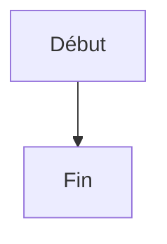
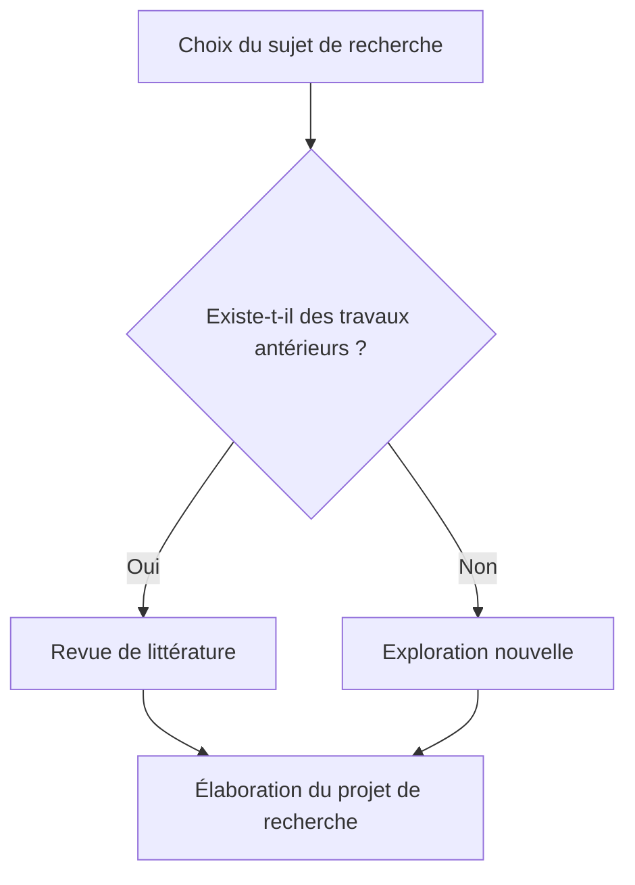
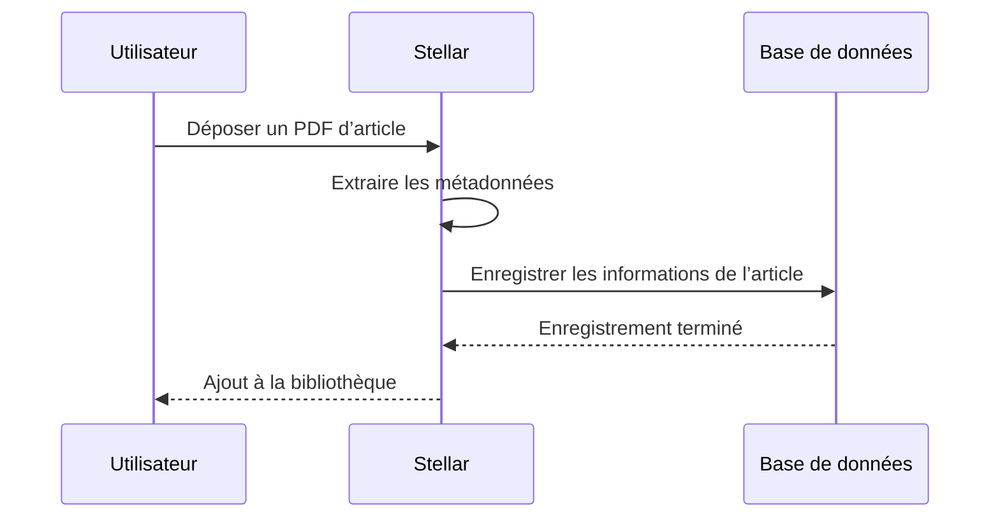
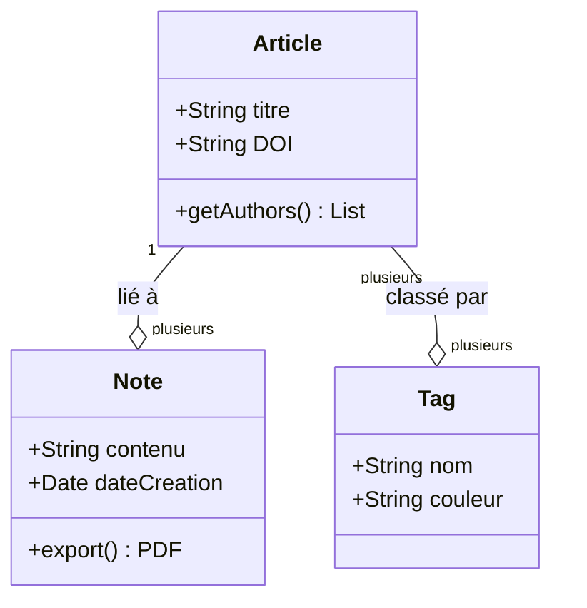
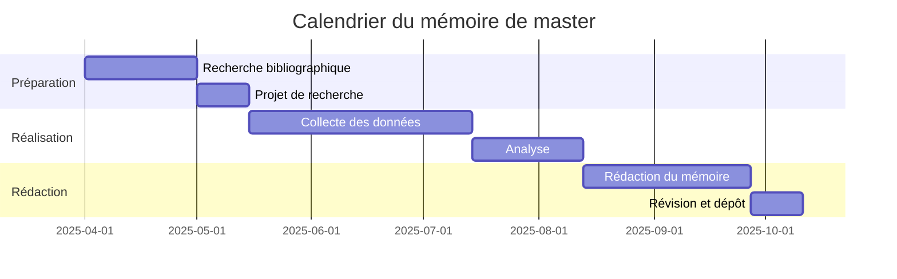
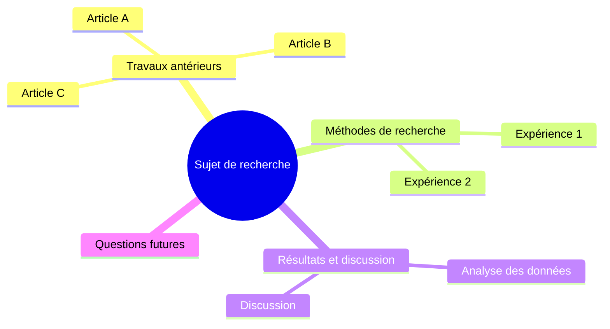
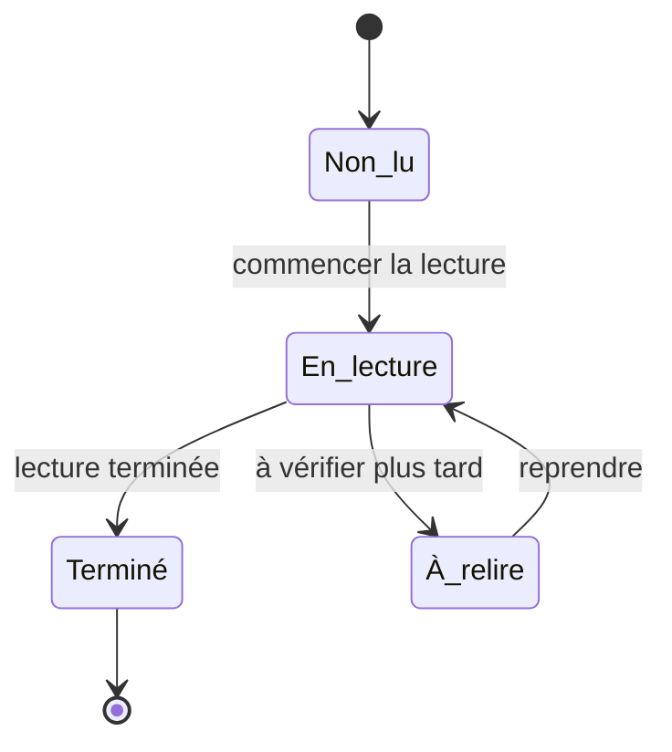
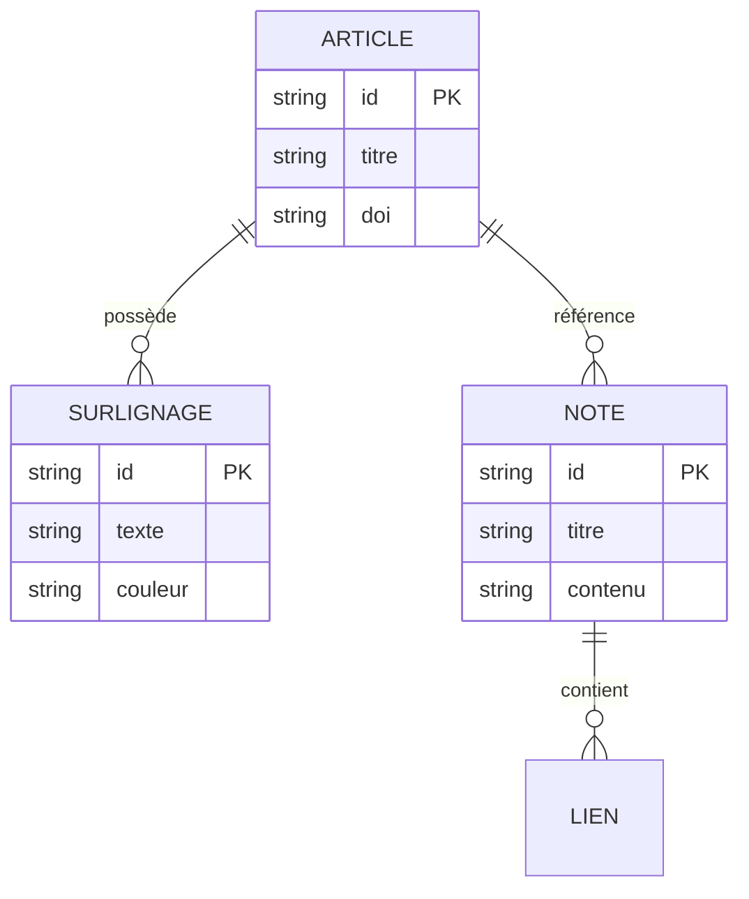
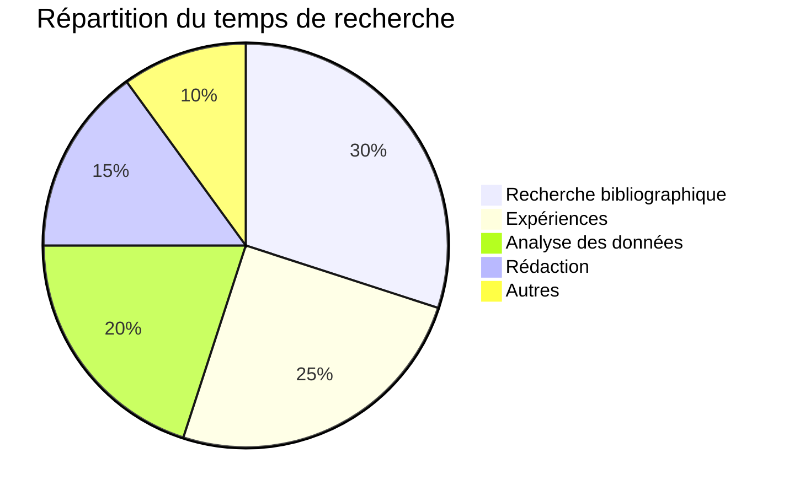

# Guide utilisateur de Stellar

## Introduction — Qu’est-ce que Stellar ?

**Stellar** est une **application de bureau d’aide à la recherche** conçue pour lire des articles et des sources, prendre des notes et organiser ses connaissances.

Avec Stellar, vous pouvez par exemple :

- gérer au même endroit les articles que vous avez lus, comme dans une bibliothèque ;
- surligner directement les passages importants dans les PDF et n’en extraire que les éléments utiles ;
- résumer vos lectures dans des notes grâce à l’éditeur Markdown intégré ;
- visualiser sous forme de graphe les liens entre articles et notes ;
- utiliser des outils de recherche avancés, notamment pour l’analyse qualitative et quantitative.

Stellar accompagne l’ensemble du travail de **recherche, de lecture et d’organisation de l’information** : projets d’enquête au lycée, rapports universitaires, mémoires, travaux de fin d’études, préparations de séminaire, etc.

---

## Table des matières

1. [Configuration initiale (onboarding)](#1-configuration-initiale-onboarding)
2. [Comprendre l’organisation de l’écran](#2-comprendre-lorganisation-de-lecran)
3. [Bibliothèque de références — collecter et gérer des articles](#3-bibliotheque-de-references-collecter-et-gerer-des-articles)
4. [Lecteur PDF — lire et surligner des articles](#4-lecteur-pdf-lire-et-surligner-des-articles)
5. [Notes — organiser ses idées](#5-notes-organiser-ses-idees)
6. [Mode brouillon — rédiger des rapports et des articles](#6-mode-brouillon-rediger-des-rapports-et-des-articles)
7. [Graphe de connaissances — visualiser les liens](#7-graphe-de-connaissances-visualiser-les-liens)
8. [Recherche globale — tout retrouver rapidement](#8-recherche-globale-tout-retrouver-rapidement)
9. [Outils d’analyse qualitative — lire les textes en profondeur](#9-outils-danalyse-qualitative-lire-les-textes-en-profondeur)
10. [Outils d’analyse quantitative (Data Studio) — travailler avec des données chiffrées](#10-outils-danalyse-quantitative-data-studio-travailler-avec-des-donnees-chiffrees)
11. [Exportation et partage](#11-exportation-et-partage)
12. [Sauvegarde cloud — garder ses données même si le PC tombe en panne](#12-sauvegarde-cloud-garder-ses-donnees-meme-si-le-pc-tombe-en-panne)
13. [Paramètres — personnaliser Stellar](#13-parametres-personnaliser-stellar)
14. [Raccourcis clavier](#14-raccourcis-clavier)
15. [Glossaire](#15-glossaire)
16. [Dépannage (FAQ)](#16-depannage-faq)

---

<a id="1-configuration-initiale-onboarding"></a>
## 1. Configuration initiale (onboarding)

Lorsque vous lancez Stellar pour la première fois, un écran de configuration en **5 étapes** apparaît.

| Étape | Élément | Description |
|---------|------|------|
| 1 | Bienvenue | Une présentation de Stellar s’affiche. Appuyez sur « Commencer » pour continuer. |
| 2 | Choix de la langue | Vous pouvez choisir entre Japanese, English, Français et Afrikaans. |
| 3 | Choix de l’emplacement de stockage | Sélectionnez le dossier où vos données seront enregistrées. Par défaut : `~/Stellar`, directement dans votre dossier personnel. Vous pouvez le laisser tel quel. |
| 4 | Choix du thème | Choisissez l’apparence de l’application, par exemple claire ou sombre. Vous pourrez la modifier plus tard. |
| 5 | Terminé | La configuration est terminée. Des raccourcis clavier utiles vous sont présentés. |

> **Astuce** : cette configuration n’a lieu qu’une seule fois. Lors des prochains lancements, Stellar ouvrira directement l’écran principal.

---

<a id="2-comprendre-lorganisation-de-lecran"></a>
## 2. Comprendre l’organisation de l’écran

L’écran de Stellar est divisé en **4 grandes zones**.

```
┌─────────────────────────────────────────────────┐
│                 Barre de titre                  │
├────────┬──────────────────────┬─────────────────┤
│        │                      │                 │
│ Barre  │   Panneau principal  │  Panneau de     │
│ latérale│  (grande zone centrale)│ contexte      │
│        │                      │  (à droite)     │
│        │                      │                 │
├────────┴──────────────────────┴─────────────────┤
│                 Barre d’état                    │
└─────────────────────────────────────────────────┘
```

### Barre latérale (à gauche)

La barre latérale contient les boutons permettant de changer d’écran. De haut en bas :

| Icône | Nom | Fonction |
|---------|------|------|
| 📚 | Bibliothèque | Affiche la liste des articles |
| 📝 | Notes | Affiche la liste des notes |
| 🔗 | Graphe | Visualise les liens entre connaissances |
| 🔬 | Analyse qualitative | Outils d’analyse textuelle |
| 📊 | Analyse quantitative | Outils d’analyse de données numériques |
| ⚙️ | Paramètres | Écran des paramètres de l’application |

> **Astuce** : la barre latérale peut être repliée. Cliquez sur le bouton en bas à gauche pour passer à un affichage compact avec icônes uniquement.

### Panneau principal (centre)

C’est la zone principale de l’écran sélectionné. Elle affiche la liste des articles, l’éditeur de notes, le lecteur PDF et les autres vues principales.

### Panneau de contexte (à droite)

Le panneau de contexte affiche les informations détaillées sur l’élément sélectionné :

- lorsqu’un article est sélectionné → tags, métadonnées, liste des surlignages, notes liées ;
- lorsqu’une note est sélectionnée → backlinks, tags, table des matières / plan.

---

<a id="3-bibliotheque-de-references-collecter-et-gerer-des-articles"></a>
## 3. Bibliothèque de références — collecter et gérer des articles

### Lire l’écran de la bibliothèque

La bibliothèque affiche la liste des articles et documents que vous avez enregistrés. Pensez-y comme à votre propre étagère de recherche.

Il existe deux **modes d’affichage** :

- **Affichage en cartes** : les articles sont présentés sous forme de cartes, comme des couvertures de magazines alignées ;
- **Affichage en liste** : les articles sont affichés ligne par ligne, comme dans un tableau Excel.

Vous pouvez changer de mode avec le bouton situé en haut à droite.

### Ajouter un article

Appuyez sur le bouton **« + Ajouter »** en haut de l’écran pour ouvrir la fenêtre d’ajout. Il existe quatre méthodes.

#### Méthode 1 : ajouter depuis un PDF (recommandé)

1. Sélectionnez l’onglet « PDF ».
2. Appuyez sur « Sélectionner un PDF » et choisissez un fichier PDF sur votre ordinateur.
3. Stellar lit automatiquement depuis le PDF des informations comme le titre, l’auteur et l’année.
4. Vérifiez les informations, puis appuyez sur « Enregistrer ».

> **Point important** : Stellar extrait les informations des métadonnées intégrées dans le fichier PDF. Si l’extraction n’est pas correcte, vous pouvez modifier les informations à la main.

#### Méthode 2 : ajouter depuis une URL

1. Sélectionnez l’onglet « URL ».
2. Collez l’URL de la page Web de l’article.
3. Appuyez sur « Récupérer » pour extraire automatiquement les informations bibliographiques de la page.
4. Vérifiez les informations, puis appuyez sur « Enregistrer ».

#### Méthode 3 : ajouter depuis un DOI

1. Sélectionnez l’onglet « DOI ».
2. Saisissez le DOI, par exemple `10.1000/xyz123`.
3. Appuyez sur « Récupérer » pour remplir automatiquement les informations bibliographiques.
4. Vérifiez les informations, puis appuyez sur « Enregistrer ».

> **Qu’est-ce qu’un DOI ?** DOI signifie Digital Object Identifier. C’est un identifiant qui permet de reconnaître un article de manière unique dans le monde entier. Il est souvent indiqué sur la page de l’article.

#### Méthode 4 : saisie manuelle

1. Sélectionnez l’onglet « Saisie manuelle ».
2. Saisissez directement le titre, l’auteur, l’année de publication, le nom de la revue, etc.
3. Appuyez sur « Enregistrer ».

### Rechercher et filtrer des articles

Plusieurs filtres sont disponibles en haut de la bibliothèque.

| Filtre | Description |
|---------|------|
| Barre de recherche | Rechercher librement par titre ou nom d’auteur |
| Tags | Filtrer selon les tags ajoutés, par exemple « apprentissage automatique » ou « psychologie » |
| Année de publication | Filtrer par année |
| Présence d’un PDF | Afficher uniquement les articles auxquels un PDF est attaché |

### Voir les détails d’un article

Cliquez sur un article dans la liste pour afficher ses détails dans le panneau de contexte à droite.

- **Informations de base** : titre, auteur, année, nom de la revue, DOI, URL ;
- **Tags** : étiquettes de classement que vous pouvez ajouter librement ;
- **Liste des surlignages** : passages que vous avez marqués dans le PDF ;
- **Notes liées** : notes associées à cet article ;
- **Réseau de citations** : références citées, articles citants et articles recommandés.

### Attacher un PDF à un article

Vous pouvez aussi attacher un PDF plus tard à un article déjà enregistré. Depuis l’écran de détail de l’article, appuyez sur « Attacher un PDF » et choisissez le fichier.

### Modifier et supprimer des articles

- **Modifier** : utilisez le bouton « Modifier » dans l’écran de détail pour corriger le titre, l’auteur ou d’autres informations.
- **Supprimer** : utilisez le bouton « Supprimer » pour supprimer l’article. Une boîte de confirmation s’affichera.
- **Actions groupées** : sélectionnez plusieurs articles avec les cases à cocher, puis supprimez-les en une seule fois.

---

<a id="4-lecteur-pdf-lire-et-surligner-des-articles"></a>
## 4. Lecteur PDF — lire et surligner des articles

### Ouvrir un PDF

Double-cliquez sur un article auquel un PDF est attaché, ou cliquez sur l’icône du lecteur, pour ouvrir l’**écran du lecteur PDF**.

L’écran est divisé en deux parties :

- **à gauche** : zone d’affichage du PDF ;
- **à droite** : panneau listant les surlignages.

### Créer un surlignage

1. Dans le PDF, **faites glisser la souris** pour sélectionner un passage important.
2. Une barre d’outils apparaît. Choisissez une couleur et cliquez dessus.
3. Le passage sélectionné est surligné.

**Quatre couleurs** sont disponibles. Vous pouvez aussi les choisir avec les touches numériques.

| Touche | Couleur | Exemple d’utilisation |
|-----|-----|----------|
| 1 | 🟡 Jaune | Passages importants |
| 2 | 🟢 Vert | Passages liés à la méthodologie |
| 3 | 🔵 Bleu | Passages liés à votre propre argument |
| 4 | 🔴 Rouge | Questions ou points à vérifier |

### Ajouter des commentaires aux surlignages

Dans la liste des surlignages à droite, vous pouvez ajouter un commentaire ou une note à chaque passage marqué. Écrire pourquoi ce passage est important vous aidera lors de la relecture.

### Créer une note à partir de surlignages

1. Dans le panneau de droite, cochez les surlignages que vous voulez utiliser dans une note.
2. Appuyez sur « Créer une note à partir de la sélection ».
3. Une nouvelle note est créée automatiquement avec les surlignages sélectionnés.

> **Astuce** : cette fonction permet de créer facilement une note de résumé d’article.

### Commandes du PDF

| Action | Méthode |
|-----|------|
| Zoom avant | `Ctrl + +` |
| Zoom arrière | `Ctrl + -` |
| Réinitialiser le zoom | `Ctrl + 0` |
| Changer de page | touches `←` / `→`, ou défilement |
| Rechercher du texte | `Ctrl + F` |

---

<a id="5-notes-organiser-ses-idees"></a>
## 5. Notes — organiser ses idées

### Organisation de l’écran des notes

Sélectionnez « Notes » dans la barre latérale. La **liste des notes** apparaît à gauche et l’**éditeur de notes** apparaît à droite.

### Créer une note

Cliquez sur le bouton **« + Nouvelle note »** au-dessus de la liste des notes pour créer une nouvelle note. Le raccourci `Ctrl + N` permet aussi d’en créer une immédiatement.

### Écrire une note : utiliser l’éditeur

L’éditeur de Stellar prend en charge **Markdown**, une manière d’écrire qui utilise des signes simples pour créer des titres, du texte en gras, etc.

#### Aide-mémoire Markdown

| Syntaxe | Résultat affiché | Signification |
|--------|---------|------|
| `# Titre` | **Grand titre** | Titre de niveau 1 |
| `## Sous-titre` | **Titre moyen** | Titre de niveau 2 |
| `### Petit sous-titre` | **Petit titre** | Titre de niveau 3 |
| `**gras**` | **gras** | Texte à mettre en valeur |
| `*italique*` | *italique* | Mise en valeur légère |
| `- Élément 1` | ・Élément 1 | Liste à puces |
| `1. Étape 1` | 1. Étape 1 | Liste numérotée |
| `> Citation` | > Citation | Citer les mots de quelqu’un |
| `` `code` `` | `code` | Code informatique ou texte technique |
| `==surlignage==` | surlignage, façon marqueur | Passage à faire ressortir |

#### WikiLink

Si vous écrivez `[[titre de la note]]` dans une note, vous pouvez créer un lien vers une autre note.

1. Tapez `[[` pour afficher une liste de suggestions.
2. Sélectionnez la note ou l’article à lier.
3. Cliquez sur le lien pour aller vers cette note.

> **C’est une fonction puissante** : lorsque vous reliez des notes avec WikiLink, ces liens apparaissent dans le **graphe de connaissances** décrit plus loin. Votre réseau de connaissances s’agrandit peu à peu.

#### Insérer une citation

Si vous écrivez `@cite{ID_de_l_article}` dans une note, Stellar insère une citation de l’article. Elle est automatiquement mise en forme selon le style bibliographique choisi, par exemple APA ou MLA.

#### Insérer un diagramme Mermaid

Si vous indiquez `mermaid` dans un bloc de code, vous pouvez générer automatiquement des organigrammes ou d’autres diagrammes à partir de texte.

Stellar inclut une **fenêtre de création de diagrammes Mermaid** accessible depuis l’icône de diagramme dans la barre d’outils. Vous pouvez choisir un modèle et le modifier avec un aperçu en direct. Vous pouvez aussi écrire directement la syntaxe Mermaid dans l’éditeur.

##### Syntaxe de base

Dans une note, écrivez un bloc de code comme celui-ci pour générer automatiquement un diagramme :

````

````

##### Types de diagrammes pris en charge et exemples

Stellar prend en charge les **8 types** de diagrammes suivants.

---

**1. Organigramme (Flowchart)** — représenter un processus ou des choix

````

````

Direction : `TD` (haut → bas), `LR` (gauche → droite), `BT` (bas → haut), `RL` (droite → gauche)

Formes de nœuds :

| Syntaxe | Forme |
|------|------|
| `A[Texte]` | Rectangle |
| `A{Texte}` | Losange, pour une décision |
| `A(Texte)` | Rectangle arrondi |
| `A((Texte))` | Cercle |
| `A>Texte]` | Forme de drapeau |

Types de flèches : `-->` flèche pleine, `-.->` flèche en pointillés, `==>` flèche épaisse, `--texte-->` flèche avec étiquette

---

**2. Diagramme de séquence (Sequence Diagram)** — représenter des échanges dans le temps

````

````

Types de flèches : `->>` ligne pleine, `-->>` ligne en pointillés, `-x` échec, `-)` asynchrone

---

**3. Diagramme de classes (Class Diagram)** — organiser des structures de données ou des relations conceptuelles

````

````

---

**4. Diagramme de Gantt (Gantt Chart)** — gérer un calendrier ou un plan de recherche

````

````

---

**5. Carte mentale (Mindmap)** — organiser des idées ou des thèmes

````

````

---

**6. Diagramme d’états (State Diagram)** — représenter les changements d’état d’un processus

````

````

---

**7. Diagramme ER (Entity Relationship Diagram)** — représenter les relations entre données

````

````

Notation des relations : `||--||` un-à-un, `||--o{` un-à-plusieurs, `}o--o{` plusieurs-à-plusieurs

---

**8. Diagramme circulaire (Pie Chart)** — visualiser des proportions

````

````

---

##### Conseils d’utilisation

- La **fenêtre de création** permet de partir de modèles. Vous n’avez donc pas besoin de mémoriser toute la syntaxe.
- Si le code du diagramme contient une erreur, un message s’affiche. Corrigez-le en vérifiant l’aperçu.
- Pour la syntaxe détaillée, consultez la [documentation officielle de Mermaid](https://mermaid.js.org/intro/).

### Barre d’outils des notes

La barre d’outils située en haut de l’éditeur propose les fonctions suivantes :

| Bouton | Fonction |
|--------|------|
| Titre | Cliquer pour modifier le titre |
| 🔍 Recherche | Rechercher du texte dans la note |
| 🎯 Mode focus | Passer à un mode concentré centré sur l’éditeur |
| 📋 Menu | Export PDF/DOCX, suppression, export en site statique, etc. |

### Enregistrement automatique

Les notes sont **enregistrées automatiquement**. L’état d’enregistrement s’affiche dans la barre d’état en bas de l’écran :

- ⏳ Enregistrement en cours…
- ✅ Enregistré, avec l’heure du dernier enregistrement

### Trier et rechercher les notes

Dans la liste des notes, vous pouvez effectuer les actions suivantes :

- **Recherche** : filtrer les notes par titre ;
- **Tri** : trier par date de modification, date de création ou titre, en ordre croissant ou décroissant.

### Lier des articles et des notes

Lorsque vous créez une note, vous pouvez l’associer à un article. Elle sera alors gérée comme une note relative à cet article et apparaîtra dans la section « Notes liées » du panneau de détail de l’article.

---

<a id="6-mode-brouillon-rediger-des-rapports-et-des-articles"></a>
## 6. Mode brouillon — rédiger des rapports et des articles

### Qu’est-ce que le mode brouillon ?

Le mode brouillon est un mode d’édition spécial, pratique pour rédiger des textes plus longs qu’une note ordinaire : rapports, essais, articles, mémoires, etc.

En mode brouillon, l’écran passe à une **mise en page à deux colonnes**.

```
┌────────────────────────────┬──────────┐
│                            │ Panneau  │
│        Éditeur principal    │ de       │
│                            │ citation │
│                            │          │
│                            │(liste de │
│                            │ références)│
└────────────────────────────┴──────────┘
```

### Panneau droit : citations / contexte

Deux onglets sont disponibles :

- **onglet Citations** : liste des articles cités et paramètres du style bibliographique ;
- **onglet Contexte** : informations liées, comme les backlinks et les tags.

### Choisir un style de citation

Vous pouvez choisir le style bibliographique dans le menu déroulant situé en haut à droite.

| Style | Description | Domaines d’utilisation courants |
|---------|------|------------|
| APA 7th | Style de l’American Psychological Association | Psychologie, sciences de l’éducation, sciences sociales |
| MLA 9th | Style de la Modern Language Association | Littérature, linguistique, sciences humaines |
| Chicago 17th | Style de l’Université de Chicago | Histoire, histoire de l’art |
| Style Hitotsubashi | Style utilisé dans certaines universités japonaises | Sciences sociales au Japon |

---

<a id="7-graphe-de-connaissances-visualiser-les-liens"></a>
## 7. Graphe de connaissances — visualiser les liens

### Lire l’écran du graphe

Sélectionnez « Graphe » dans la barre latérale pour afficher le **graphe de connaissances**.

Cette fonction montre les liens entre vos articles et vos notes sous la forme d’un **graphe de réseau**.

- **Points ronds (nœuds)** : chaque point représente un article ou une note.
- **Lignes (liens)** : chaque ligne représente une relation entre un article et une note, ou entre deux notes.

### Types de nœuds

| Type | Apparence | Contenu |
|------|--------|------|
| Article | Cercle d’une certaine couleur | Article enregistré dans la bibliothèque |
| Note | Cercle d’une autre couleur | Note que vous avez créée |

### Utiliser le graphe

| Action | Méthode |
|------|------|
| Se déplacer | Faire glisser |
| Zoomer | Faire défiler |
| Voir les informations d’un nœud | Placer la souris sur le nœud pour afficher une infobulle |
| Sélectionner un nœud | Cliquer |
| Ouvrir une note ou un article | Double-cliquer |
| Annuler la sélection | Cliquer sur l’arrière-plan ou appuyer sur `Esc` |
| Revenir à la vue d’ensemble | `Ctrl + 0` |

### Panneau de filtres (en haut à droite)

Vous pouvez limiter les nœuds affichés :

- par type de nœud : articles seulement, notes seulement ou les deux ;
- par tag.

### Panneau de légende (en bas à gauche)

Ce panneau affiche le nombre de nœuds et de liens visibles, ainsi que la signification des couleurs. Le bouton « Vue d’ensemble » s’y trouve également.

### Minicarte (en bas à droite)

La minicarte affiche une petite vue d’ensemble du graphe. Cliquez dessus pour déplacer le graphe principal vers cette zone.

---

<a id="8-recherche-globale-tout-retrouver-rapidement"></a>
## 8. Recherche globale — tout retrouver rapidement

Appuyez sur **`Ctrl + K`** (Mac : `Cmd + K`) pour afficher la **fenêtre de recherche globale** au centre de l’écran.

### Ce que vous pouvez rechercher

- titres et noms d’auteurs d’articles ;
- titres et corps des notes ;
- texte des surlignages dans les PDF.

### Utilisation

1. Ouvrez la fenêtre avec `Ctrl + K`.
2. Saisissez un mot-clé. Les résultats s’affichent en temps réel.
3. Filtrez avec les onglets : tout / articles / notes / surlignages.
4. Déplacez-vous dans les résultats avec `↑` et `↓`, puis ouvrez avec `Enter`.
5. Fermez avec `Esc`.

> **Astuce** : la recherche est en texte intégral. Les contenus écrits dans les notes peuvent aussi être retrouvés.

---

<a id="9-outils-danalyse-qualitative-lire-les-textes-en-profondeur"></a>
## 9. Outils d’analyse qualitative — lire les textes en profondeur

### Qu’est-ce que l’analyse qualitative ?

L’analyse qualitative consiste à classer et analyser de manière systématique des textes, des entretiens ou d’autres documents. Elle est souvent utilisée en sociologie, psychologie, sciences de l’éducation et sciences humaines.

### Créer un projet

1. Sélectionnez « Analyse qualitative » dans la barre latérale.
2. Créez un projet avec le bouton « + Nouveau projet ».
3. Définissez le nom du projet et la méthode d’analyse, par exemple l’analyse thématique.

### Les 11 onglets d’analyse

La vue d’analyse qualitative contient les onglets suivants :

| Onglet | Nom | Contenu |
|------|------|------|
| 1 | Tableau de bord | Affiche un aperçu du projet |
| 2 | Codebook | Attribuer des « codes » ou étiquettes aux textes pour les classer |
| 3 | Matrice de codage | Tableau croisé des codes et des données |
| 4 | ICR, fiabilité inter-évaluateurs | Calculer le degré d’accord entre plusieurs évaluateurs |
| 5 | Critique des sources | Formulaire pour évaluer la fiabilité des sources |
| 6 | Chronologie | Organiser les événements dans l’ordre chronologique |
| 7 | Carte des acteurs | Visualiser les relations entre acteurs |
| 8 | Process tracing | Suivre les mécanismes causaux étape par étape |
| 9 | Plan de comparaison | Comparer plusieurs cas |
| 10 | Analyse du cadrage | Analyser les « cadres » ou frames utilisés par les médias, documents, etc. |
| 11 | Rapport d’analyse | Générer un rapport à partir des résultats |

> **Note pour les lycéens** : il n’est pas nécessaire de tout utiliser dès le début. Pour un projet d’enquête, commencez plutôt par le « Codebook » et la « Chronologie ».

---

<a id="10-outils-danalyse-quantitative-data-studio-travailler-avec-des-donnees-chiffrees"></a>
## 10. Outils d’analyse quantitative (Data Studio) — travailler avec des données chiffrées

### Qu’est-ce que Data Studio ?

Data Studio est une fonction qui permet d’importer des résultats d’enquête ou des données numériques pour les analyser statistiquement.

### Organisation de l’écran

La liste des jeux de données s’affiche à gauche. Le contenu, organisé par onglets, s’affiche à droite.

### Les 4 onglets

| Onglet | Nom | Contenu |
|------|------|------|
| 1 | Importer | Charger des données depuis un fichier CSV |
| 2 | Définition des variables | Définir le nom et le type de chaque colonne : numérique, catégorie, etc. |
| 3 | Aperçu des données | Vérifier les données importées sous forme de tableau |
| 4 | Analyse | Exécuter des analyses statistiques |

### Importer des données

1. Sélectionnez l’onglet « Importer ».
2. Choisissez un fichier CSV, c’est-à-dire un fichier texte séparé par des virgules, exporté depuis Excel ou un autre outil.
3. Les données sont chargées.

### Types d’analyses

Dans l’onglet Analyse, vous pouvez effectuer notamment les analyses suivantes :

| Méthode | Contenu | Exemple d’utilisation |
|---------|------|----------|
| Statistiques descriptives | Moyenne, médiane, écart type, etc. | Résumé de base des résultats d’une enquête |
| Statistiques inférentielles | Test t, test du chi carré, etc. | Tester les différences entre groupes |
| Analyse d’enquête | Analyses propres aux questionnaires | Agréger des échelles de Likert |
| Analyse textuelle | Traitement statistique de données textuelles | Analyser des réponses libres |
| Analyse de réseau | Analyse de données relationnelles | Réseau de cooccurrences, etc. |

---

<a id="11-exportation-et-partage"></a>
## 11. Exportation et partage

### Exporter les données

Depuis l’onglet « Données » des paramètres, vous pouvez exporter toutes vos données :

- **Export JSON** : télécharger tous les articles et toutes les notes au format JSON ;
- **Créer une sauvegarde** : enregistrer un fichier de sauvegarde contenant toutes les données, y compris articles, notes, surlignages et liens.

### Paquet de recherche, fichier `.stellar`

Cette fonction permet d’exporter et d’importer un projet de recherche complet.

**Exporter** :

1. Paramètres → onglet Données → section « Paquet de recherche ».
2. Sélectionnez les articles et notes à inclure.
3. Choisissez d’inclure ou non les PDF.
4. Sélectionnez l’emplacement de sauvegarde et exportez.

**Importer** :

1. Sélectionnez un fichier `.stellar`.
2. Le contenu du paquet s’affiche.
3. Choisissez comment gérer les conflits, par exemple lorsqu’une donnée portant le même ID existe déjà.
4. Lancez l’importation.

> **Exemple d’utilisation** : pratique pour partager en une seule fois une liste d’articles et des notes avec les membres d’un groupe de recherche.

### Exporter des notes

Depuis le menu de l’éditeur de notes, vous pouvez exporter dans les formats suivants :

| Format | Description |
|------|------|
| PDF | Convertir en PDF prêt pour l’impression |
| DOCX | Convertir au format Microsoft Word |
| Site statique | Exporter sous forme de site Web HTML |

### Export en site statique

Cette fonction permet de sélectionner des notes et de les exporter comme site Web.

1. Sélectionnez les notes à exporter.
2. Définissez le titre du site.
3. Choisissez le thème, clair ou sombre.
4. Choisissez d’inclure ou non les backlinks.
5. Choisissez le dossier de sortie et générez le site.

---

<a id="12-sauvegarde-cloud-garder-ses-donnees-meme-si-le-pc-tombe-en-panne"></a>
## 12. Sauvegarde cloud — garder ses données même si le PC tombe en panne

### Qu’est-ce que la sauvegarde cloud ?

La sauvegarde cloud est une fonction qui enregistre automatiquement dans le cloud, sous forme **chiffrée**, toutes les données conservées dans Stellar : articles, notes, surlignages et liens.

Même si votre ordinateur tombe en panne ou si vous le remplacez, vous pouvez restaurer complètement vos données sur un nouveau PC avec un **code de récupération à 12 caractères**.

### Qu’est-ce qui la rend pratique ?

| Sauvegarde classique | Sauvegarde cloud de Stellar |
|---|---|
| Nécessite la création d’un compte | **Non nécessaire** — il suffit d’appuyer sur un bouton |
| Nécessite un mot de passe | **Non nécessaire** — un code est généré automatiquement |
| Oblige à choisir soi-même l’emplacement de sauvegarde | **Non nécessaire** — la sauvegarde est envoyée automatiquement dans le cloud |
| La restauration peut être compliquée | **Il suffit de saisir le code à 12 caractères** |

> **Sécurité** : les données sont chiffrées sur votre PC avant l’envoi, avec AES-256-GCM. Le serveur ne peut pas voir le contenu des données.

### Configuration initiale, une seule fois

1. Ouvrez les **paramètres**, depuis l’icône ⚙️ de la barre latérale ou avec `Ctrl + ,`.
2. Sélectionnez l’onglet **« Données »**.
3. Faites défiler l’écran jusqu’à la section **« Sauvegarde cloud »**.
4. Appuyez sur **« Activer la sauvegarde cloud »**.
5. Un **code de récupération** à 12 caractères, au format `XXXX-XXXX-XXXX`, s’affiche.

> **⚠️ Très important** : conservez absolument le code de récupération dans un endroit sûr.
>
> - Écrivez-le sur papier et gardez-le dans votre portefeuille.
> - Enregistrez-le dans l’application de notes de votre smartphone.
> - Ajoutez-le à un gestionnaire de mots de passe.
>
> Si vous perdez ce code, vous ne pourrez pas restaurer vos données en cas de panne de votre PC.

### Effectuer une sauvegarde

#### Sauvegarde manuelle

1. Paramètres → onglet Données → section Sauvegarde cloud.
2. Appuyez sur **« Sauvegarder maintenant »**.
3. La sauvegarde se termine en quelques secondes à une dizaine de secondes.
4. Une fois terminée, le message « Sauvegarde cloud terminée » s’affiche.

#### Sauvegarde automatique, recommandée

Activez l’interrupteur **« Sauvegarde automatique »**. Stellar effectuera alors une sauvegarde automatiquement à chaque lancement. Vous n’aurez plus à y penser.

### Consulter l’historique des sauvegardes

La section Sauvegarde cloud affiche aussi un **historique des sauvegardes** :

- **Date et heure** : moment de la sauvegarde ;
- **Nombre de données** : nombre d’articles, de notes, de surlignages et de liens ;
- **Taille** : taille du fichier de sauvegarde ;
- **Bouton « Restaurer »** : restaurer les données à partir de cette sauvegarde.

### Mon PC est cassé ! Restaurer les données

Après avoir installé Stellar sur un nouveau PC, suivez ces étapes :

1. Ouvrez Paramètres → onglet Données.
2. Trouvez la section **« Restaurer avec un code de récupération »**.
3. Saisissez le **code de récupération à 12 caractères** que vous aviez conservé, au format `XXXX-XXXX-XXXX`.
4. Appuyez sur **« Restaurer »**.
5. La liste des sauvegardes s’affiche.
6. Appuyez sur **« Restaurer »** pour la sauvegarde souhaitée.
7. Les données sont restaurées.

> **Point rassurant** : la restauration se fait par fusion. Si vous avez déjà créé de nouvelles données sur le nouveau PC, elles ne seront pas écrasées. Seules les nouvelles données présentes dans la sauvegarde seront ajoutées.

### Vérifier et copier le code de récupération

Si la sauvegarde cloud est déjà configurée, vous pouvez consulter le code de récupération dans les paramètres :

1. Paramètres → onglet Données → section Sauvegarde cloud.
2. Le code de récupération est affiché **flouté**, pour des raisons de sécurité.
3. Appuyez sur **« Afficher »** pour le voir.
4. Appuyez sur **« Copier »** pour le copier dans le presse-papiers.

### Quand le réseau n’est pas disponible

Même sans connexion Internet, les données de sauvegarde sont automatiquement enregistrées de façon chiffrée dans le dossier local de votre ordinateur : `~/.stellar/cloud_backups/`. Elles seront envoyées dans le cloud lors de la prochaine connexion Internet.

---

<a id="13-parametres-personnaliser-stellar"></a>
## 13. Paramètres — personnaliser Stellar

Vous pouvez ouvrir les paramètres avec l’icône ⚙️ de la barre latérale ou avec `Ctrl + ,`.

### Onglet Apparence

| Élément | Description |
|------|------|
| Thème | Modifier les couleurs de l’écran : clair, sombre, etc. |
| Taille de police | Taille des caractères, de 13 px à 16 px |
| Hauteur de ligne | Espacement entre les lignes, de 1,5 à 2,0 |
| Police de l’éditeur | Police utilisée dans l’éditeur de notes |

### Onglet Données

| Élément | Description |
|------|------|
| Résumé des données | Nombre d’articles, de notes et de surlignages ; espace disque utilisé |
| Chemin de stockage | Vérifier ou modifier le dossier de sauvegarde des données |
| Exportation | Exporter toutes les données en JSON |
| Sauvegarde locale | Créer une sauvegarde complète sur votre PC |
| Paquet de recherche | Importer / exporter au format `.stellar` |
| Intégration navigateur | Vérifier l’état de Stellar Clipper, l’extension de navigateur |
| **Sauvegarde cloud** | **Configuration, exécution, historique et restauration de la sauvegarde cloud chiffrée. Voir [chapitre 12](#12-sauvegarde-cloud-garder-ses-donnees-meme-si-le-pc-tombe-en-panne).** |

### Onglet Raccourcis

Tous les raccourcis clavier sont affichés, classés par catégorie.

### Onglet Style de citation

| Élément | Description |
|------|------|
| Style bibliographique par défaut | Choisir entre APA 7th, MLA 9th, Chicago 17th et le style Hitotsubashi |
| Ordre des noms d’auteur | Choisir entre nom → prénom ou prénom → nom |

### Onglet Langue

Permet de changer la langue d’affichage. Langues prises en charge :

- 🇯🇵 日本語
- 🇬🇧 English
- 🇫🇷 Français
- 🇿🇦 Afrikaans

---

<a id="14-raccourcis-clavier"></a>
## 14. Raccourcis clavier

Apprendre les raccourcis les plus fréquents accélère nettement le travail.

### Navigation

| Raccourci | Fonction |
|---------------|------|
| `Ctrl + K` | Ouvrir la recherche globale |
| `Ctrl + N` | Créer une nouvelle note |
| `Ctrl + ,` | Ouvrir les paramètres |
| `Ctrl + 1` | Passer à la bibliothèque |
| `Ctrl + 2` | Passer à la liste des notes |
| `Ctrl + 3` | Passer au graphe |
| `Ctrl + [` | Retour |
| `Ctrl + ]` | Avancer |

### Éditeur, lors de la modification d’une note

| Raccourci | Fonction |
|---------------|------|
| `Ctrl + S` | Enregistrer |
| `Ctrl + B` | Gras |
| `Ctrl + I` | Italique |
| `Ctrl + Z` | Annuler |
| `Ctrl + Shift + Z` | Rétablir |
| `[[` | Commencer l’insertion d’un WikiLink |

### Lecteur PDF

| Raccourci | Fonction |
|---------------|------|
| `Ctrl + +` | Zoom avant |
| `Ctrl + -` | Zoom arrière |
| `Ctrl + 0` | Réinitialiser le zoom |
| `Ctrl + F` | Rechercher dans le PDF |
| `1` / `2` / `3` / `4` | Choisir la couleur du surlignage |

### Graphe

| Raccourci | Fonction |
|---------------|------|
| Défilement | Zoomer |
| Glisser | Déplacer le graphe |
| Double-clic | Ouvrir un nœud |
| `Esc` | Annuler la sélection |
| `Ctrl + 0` | Vue d’ensemble |

> **Pour les utilisateurs de Mac** : remplacez `Ctrl` par `Cmd` (⌘).

---

<a id="15-glossaire"></a>
## 15. Glossaire

Voici quelques termes qui peuvent apparaître pour la première fois.

| Terme | Signification |
|------|------|
| **Markdown** | Manière d’écrire qui utilise des signes pour la mise en forme, par exemple `# Titre` ou `**gras**`. Elle est souvent utilisée par les programmeurs et les rédacteurs. |
| **DOI** | Une sorte d’« adresse » d’article. C’est un identifiant qui permet de retrouver un article unique dans le monde entier. |
| **WikiLink** | Mécanisme permettant de créer un lien vers une autre note en écrivant `[[nom de la note]]`, comme dans un wiki. |
| **Backlink** | Lien inverse indiquant depuis quelles notes une note donnée est liée. |
| **Graphe de connaissances** | Fonction qui affiche les liens entre notes et articles sous forme de graphe de réseau. |
| **Surlignage** | Marqueur appliqué dans un PDF. Le texte et sa position sont enregistrés. |
| **Tag** | Étiquette de classement ajoutée à un article ou à une note, par exemple « psychologie » ou « à utiliser dans le chapitre 3 ». |
| **Style de citation** | Règles de mise en forme d’une bibliographie, par exemple APA ou MLA. |
| **Analyse qualitative** | Méthode d’analyse systématique de données constituées de mots, d’images ou de textes. |
| **Analyse quantitative** | Méthode d’analyse statistique de données numériques. |
| **CSV** | Comma Separated Values. Fichier texte où les données sont séparées par des virgules. Il peut être exporté depuis Excel. |
| **Brouillon** | Version non définitive d’un texte. Le mode brouillon permet de gérer la structure et les citations. |
| **Mermaid** | Mécanisme permettant de générer automatiquement des diagrammes, comme des organigrammes, à partir de texte. |
| **Paquet de recherche** | Fichier `.stellar` regroupant articles, notes et surlignages pour export ou partage. |
| **Sauvegarde cloud** | Fonction qui chiffre les données et les stocke dans le cloud. Même si le PC tombe en panne, elles peuvent être restaurées avec un code de récupération. |
| **Code de récupération** | Code à 12 caractères au format `XXXX-XXXX-XXXX`, utilisé pour restaurer une sauvegarde cloud. Il est généré automatiquement pour chaque PC. |
| **Chiffrement E2E** | Chiffrement de bout en bout. Les données sont chiffrées avant l’envoi, de sorte que le serveur ne peut pas en voir le contenu. |

---

<a id="16-depannage-faq"></a>
## 16. Dépannage (FAQ)

### Q : J’essaie d’ajouter un article, mais Stellar ne parvient pas à récupérer le titre depuis le PDF.

**R** : Les métadonnées du PDF, c’est-à-dire les informations intégrées au fichier, peuvent être insuffisantes. Dans ce cas, Stellar essaie de deviner le titre à partir du nom du fichier, mais le plus sûr est de le corriger manuellement.

### Q : J’ai l’impression que l’enregistrement automatique des notes ne fonctionne pas correctement.

**R** : Vérifiez la barre d’état en bas de l’écran. Si « Enregistré » est affiché, tout va bien. L’enregistrement automatique se lance quelques secondes après que vous avez cessé de taper.

### Q : Rien ne s’affiche dans le graphe.

**R** : Le graphe affiche uniquement les nœuds qui possèdent des liens. Essayez les actions suivantes :

1. Écrire un WikiLink comme `[[nom d’une autre note]]` dans une note.
2. Associer une note à un article.
3. Vérifier qu’aucun filtre ne masque les éléments, ou essayer le bouton « Réinitialiser les filtres ».

### Q : J’ai peur que mes données disparaissent.

**R** : Le plus recommandé est d’activer la **sauvegarde cloud**.

1. Paramètres → onglet Données → appuyer sur « Activer la sauvegarde cloud ».
2. Conserver le code de récupération affiché dans un endroit sûr.
3. Activer la « Sauvegarde automatique ».

Avec ces trois étapes, vous pourrez restaurer vos données même si votre PC tombe en panne. Pour plus de détails, voir [12. Sauvegarde cloud](#12-sauvegarde-cloud-garder-ses-donnees-meme-si-le-pc-tombe-en-panne).

Autres mesures possibles :

- créer régulièrement une sauvegarde locale depuis Paramètres → onglet Données → « Créer une sauvegarde » ;
- exporter votre travail sous forme de fichier `.stellar` avec la fonction « Paquet de recherche ».

### Q : J’ai perdu le code de récupération de la sauvegarde cloud.

**R** : Si la sauvegarde cloud est déjà configurée, vous pouvez le vérifier dans Paramètres → onglet Données → section Sauvegarde cloud. Appuyez sur « Afficher » pour retirer le floutage et voir le code. Vous pouvez aussi le copier avec le bouton « Copier ».

En revanche, **si votre PC est déjà tombé en panne et que vous ne connaissez pas le code, il n’est malheureusement pas possible de restaurer la sauvegarde cloud.** Conservez toujours le code ailleurs : papier, smartphone, gestionnaire de mots de passe, etc.

### Q : La sauvegarde cloud est-elle sûre ? Mes données peuvent-elles fuiter ?

**R** : Elle est sûre. Les données sont chiffrées sur votre PC avec **AES-256-GCM**, un mécanisme très robuste, avant d’être envoyées au serveur. Le serveur ne possède pas la clé de déchiffrement ; même l’administrateur du serveur ne peut donc pas lire le contenu des données. C’est du chiffrement de bout en bout.

### Q : Puis-je sauvegarder sans connexion Internet ?

**R** : Oui. En mode hors ligne, une sauvegarde chiffrée est automatiquement enregistrée dans votre ordinateur, dans `~/.stellar/cloud_backups/`. Elle sera synchronisée avec le cloud lors de la prochaine connexion Internet.

### Q : J’ai changé de langue, mais certaines parties ne changent pas.

**R** : Le changement de langue est presque immédiat. Si certaines parties ne changent pas, essayez de redémarrer l’application.

### Q : L’extension de navigateur Stellar Clipper reste sur « en attente ».

**R** : Stellar Clipper fonctionne lorsque l’application de bureau Stellar est lancée. Vérifiez les points suivants :

1. L’application de bureau Stellar est-elle ouverte ?
2. L’extension de navigateur est-elle installée ?
3. Avez-vous consulté Paramètres → onglet Données → « Instructions d’installation » ?

### Q : L’analyse qualitative et l’analyse quantitative ont l’air difficiles…

**R** : Vous n’avez pas besoin de les utiliser tout de suite. Les bases de Stellar sont les trois fonctions suivantes : **gestion des articles**, **notes** et **graphe**. Les outils d’analyse peuvent être abordés petit à petit, lorsque vous en aurez besoin.

---

## Pour finir

Stellar accompagne tout le cycle de recherche : **lire → réfléchir → écrire → relier**.

Commencez par enregistrer des articles et lire des PDF. Puis, lorsque vous vous y habituerez, résumez vos lectures dans des notes, reliez-les avec WikiLink, et élargissez progressivement votre manière d’utiliser l’application.

Plus vous utiliserez Stellar, plus votre réseau de connaissances se développera.

**Bonne recherche !** ✨
