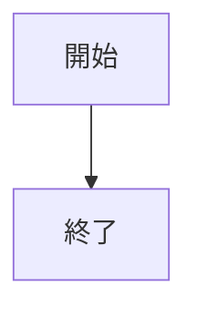
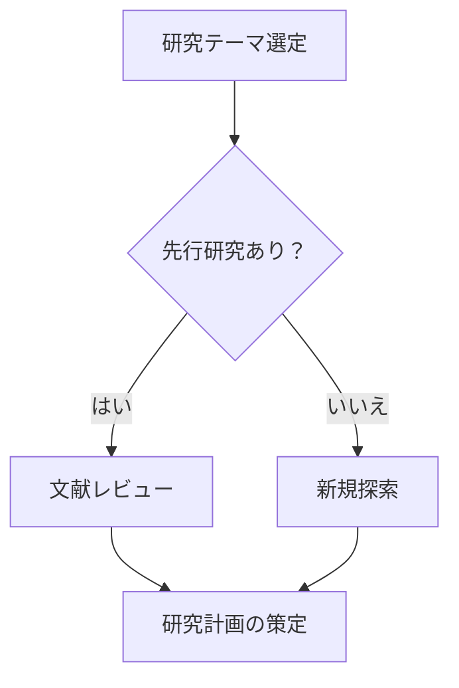
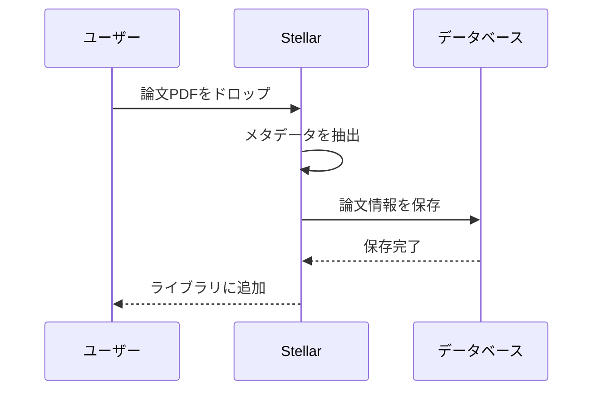
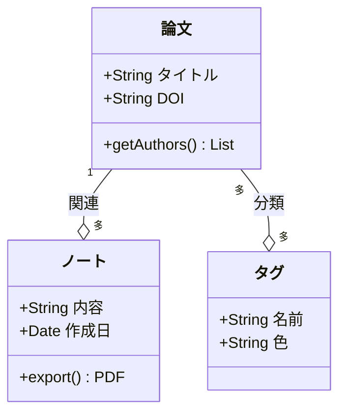
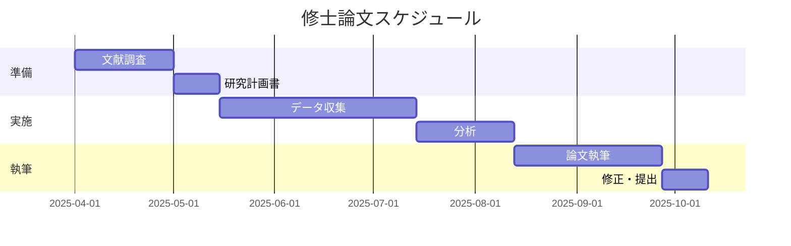
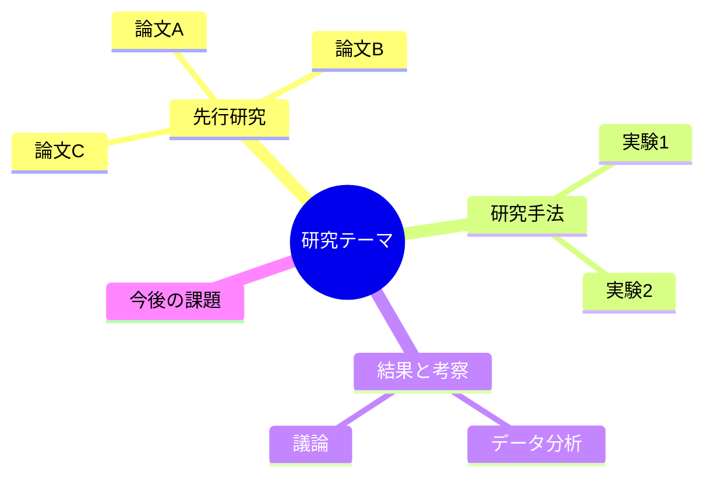
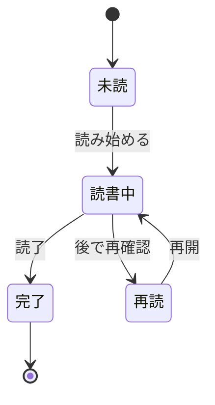
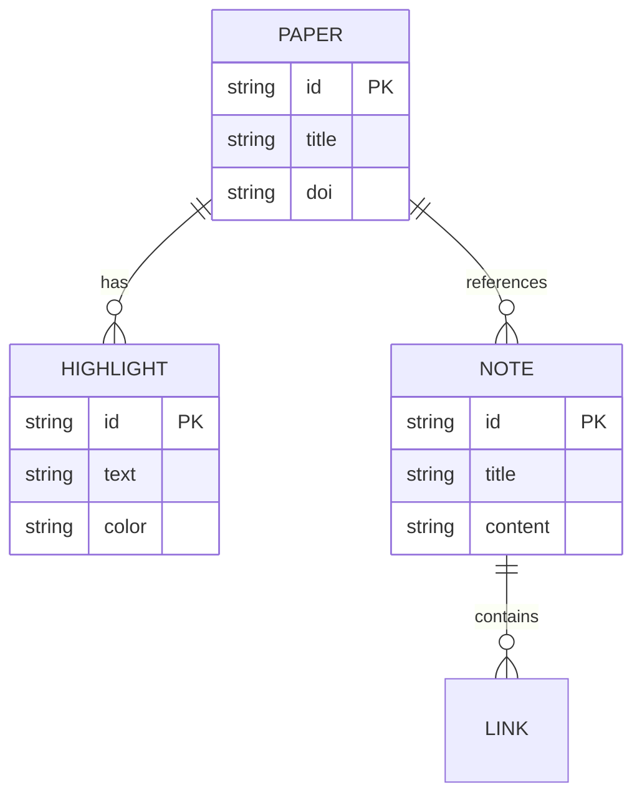
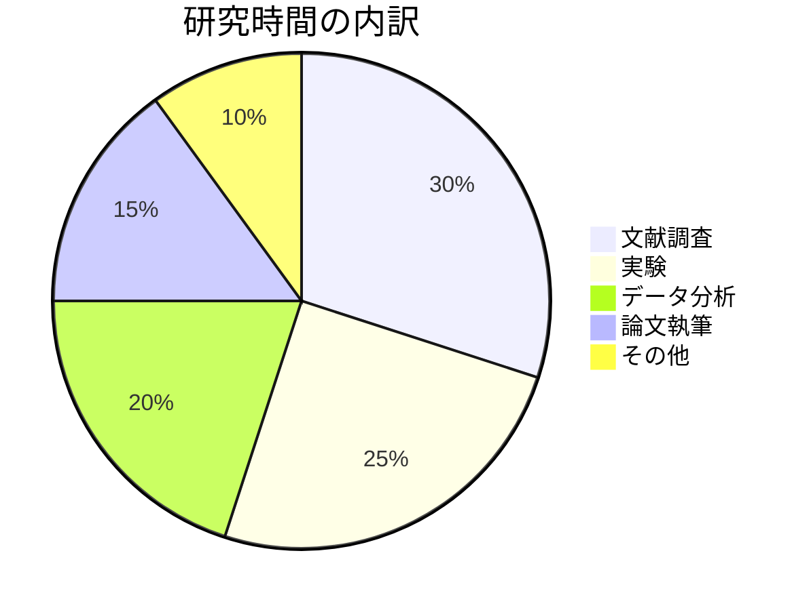

# Stellar ユーザーガイド

## はじめに — Stellar ってなに？

**Stellar（ステラ）** は、論文や文献を読んで、メモを取って、知識を整理するための **研究支援デスクトップアプリ** です。

たとえば、こんなことができます：

- 読んだ論文を一か所にまとめて管理する（本棚のようなイメージ）
- PDFに直接マーカーを引いて、大事なところだけ抜き出す
- 読んだ内容をノートにまとめる（Markdownエディタ付き）
- 論文とノートのつながりを「グラフ」で可視化する
- 質的分析・量的分析といった本格的な研究ツールも内蔵

高校の探究活動、大学のレポート、卒業論文、ゼミの発表準備など、**「調べてまとめる」作業をまるごとサポート**してくれるアプリです。

---

## 目次

1. [初回セットアップ（オンボーディング）](#1-初回セットアップオンボーディング)
2. [画面の構成を理解しよう](#2-画面の構成を理解しよう)
3. [文献ライブラリ — 論文を集めて管理する](#3-文献ライブラリ--論文を集めて管理する)
4. [PDFリーダー — 論文を読んでハイライトする](#4-pdfリーダー--論文を読んでハイライトする)
5. [ノート — 考えをまとめる](#5-ノート--考えをまとめる)
6. [草稿モード — レポートや論文を書く](#6-草稿モード--レポートや論文を書く)
7. [ナレッジグラフ — つながりを見える化する](#7-ナレッジグラフ--つながりを見える化する)
8. [グローバル検索 — なんでもすぐに見つける](#8-グローバル検索--なんでもすぐに見つける)
9. [質的分析ツール — テキストを深く読み解く](#9-質的分析ツール--テキストを深く読み解く)
10. [量的分析ツール（Data Studio）— 数字を扱う](#10-量的分析ツールdata-studio-数字を扱う)
11. [エクスポートと共有](#11-エクスポートと共有)
12. [設定 — 自分好みにカスタマイズ](#12-設定--自分好みにカスタマイズ)
13. [キーボードショートカット一覧](#13-キーボードショートカット一覧)
14. [用語集](#14-用語集)
15. [困ったときは（FAQ）](#15-困ったときはfaq)

---

## 1. 初回セットアップ（オンボーディング）

Stellarを初めて起動すると、**5ステップのセットアップ画面**が表示されます。

| ステップ | 内容 | 説明 |
|---------|------|------|
| 1 | ようこそ | Stellarの紹介が表示されます。「はじめる」を押して次へ。 |
| 2 | 言語選択 | 日本語・English・Français・Afrikaans から選べます。 |
| 3 | 保存先の選択 | データの保存フォルダを選びます。初期値は `~/Stellar`（ホームフォルダ直下）。そのままでOKです。 |
| 4 | テーマ選択 | 見た目（明るい／暗いなど）を選びます。あとから変更できるので、好きなものを選んでください。 |
| 5 | 完了 | セットアップ完了！便利なショートカットキーが紹介されます。 |

> **ヒント**: セットアップは一度だけです。次回からはすぐにメイン画面が開きます。

---

## 2. 画面の構成を理解しよう

Stellarの画面は大きく **4つのエリア** に分かれています。

```
┌─────────────────────────────────────────────────┐
│                 タイトルバー                       │
├────────┬──────────────────────┬─────────────────┤
│        │                      │                 │
│ サイド  │   メインペイン        │  コンテキスト   │
│ バー    │  （中央の広い場所）    │  パネル（右）   │
│        │                      │                 │
│        │                      │                 │
├────────┴──────────────────────┴─────────────────┤
│             ステータスバー                         │
└─────────────────────────────────────────────────┘
```

### サイドバー（左端）

画面の切り替えボタンが並んでいます。上から順に：

| アイコン | 名前 | 機能 |
|---------|------|------|
| 📚 | ライブラリ | 論文の一覧を表示 |
| 📝 | ノート | ノートの一覧を表示 |
| 🔗 | グラフ | 知識のつながりを可視化 |
| 🔬 | 質的分析 | テキスト分析ツール |
| 📊 | 量的分析 | 数値データ分析ツール |
| ⚙️ | 設定 | アプリの設定画面 |

> **ヒント**: サイドバーは折りたためます。左下のボタンをクリックすると、アイコンだけのコンパクト表示に切り替わります。

### メインペイン（中央）

選んだ画面の本体が表示されるエリアです。論文の一覧、ノートの編集画面、PDFリーダーなどが表示されます。

### コンテキストパネル（右端）

選択中のアイテムの詳細情報が表示されます：
- 論文を選択しているとき → タグ、メタデータ、ハイライト一覧、関連ノート
- ノートを選択しているとき → バックリンク（リンク元）、タグ、目次（アウトライン）

---

## 3. 文献ライブラリ — 論文を集めて管理する

### ライブラリ画面の見かた

ライブラリは、あなたが登録した論文・文献を一覧表示する画面です。本棚のようなものだと思ってください。

**表示形式** は2種類：
- **カード表示**: 論文がカード型で並びます（雑誌の表紙を並べたイメージ）
- **リスト表示**: 論文が一行ずつ表示されます（エクセルの表のようなイメージ）

右上のボタンで切り替えられます。

### 論文を追加する

画面上部の **「＋ 追加」ボタン** を押すと、追加モーダルが開きます。4つの方法があります：

#### 方法1: PDFから追加（おすすめ）

1. 「PDF」タブを選択
2. 「PDFを選択」ボタンを押して、パソコン上のPDFファイルを選ぶ
3. Stellarが自動的にタイトル・著者・年などの情報をPDFから読み取ります
4. 内容を確認して「保存」

> **ポイント**: PDFのメタデータ（ファイルに埋め込まれた情報）から自動抽出します。うまく読み取れないときは手動で修正できます。

#### 方法2: URLから追加

1. 「URL」タブを選択
2. 論文のWebページURLを貼り付ける
3. 「取得」ボタンを押すと、ページから書誌情報を自動で取り出します
4. 内容を確認して「保存」

#### 方法3: DOIから追加

1. 「DOI」タブを選択
2. DOI（例：`10.1000/xyz123`）を入力
3. 「取得」ボタンを押すと、書誌情報が自動で入ります
4. 内容を確認して「保存」

> **DOIとは？**: Digital Object Identifierの略で、論文を世界中で一意に識別するIDです。論文のページによく書いてあります。

#### 方法4: 手入力

1. 「手入力」タブを選択
2. タイトル、著者、発行年、ジャーナル名などを直接入力
3. 「保存」

### 論文を検索・絞り込む

ライブラリ上部には、さまざまなフィルタが用意されています：

| フィルタ | 説明 |
|---------|------|
| 検索バー | タイトルや著者名で自由に検索 |
| タグ | 付けたタグで絞り込む（例：「機械学習」「心理学」） |
| 発行年 | 年ごとに絞り込む |
| PDF有無 | PDFが添付されている論文だけを表示 |

### 論文の詳細を見る

一覧から論文をクリックすると、右側のコンテキストパネルに詳細が表示されます：

- **基本情報**: タイトル、著者、年、ジャーナル名、DOI、URL
- **タグ**: 分類用のラベル（自由に追加可能）
- **ハイライト一覧**: PDFに引いたマーカーの一覧
- **関連ノート**: この論文に紐づけたノートの一覧
- **引用ネットワーク**: この論文の参照先・被引用文献・おすすめ論文

### 論文にPDFを添付する

すでに登録した論文にあとからPDFを添付することもできます。論文の詳細画面から「PDFを添付」ボタンを押してファイルを選んでください。

### 論文を編集・削除する

- **編集**: 論文の詳細画面にある「編集」ボタンから、タイトル・著者などを修正できます
- **削除**: 「削除」ボタンで論文を削除できます（確認ダイアログが表示されます）
- **一括操作**: チェックボックスで複数の論文を選んで、まとめて削除できます

---

## 4. PDFリーダー — 論文を読んでハイライトする

### PDFを開く

PDFが添付されている論文をダブルクリックする（またはリーダーアイコンをクリック）と、**PDFリーダー画面**が開きます。

画面は左右に分かれています：
- **左側**: PDFの表示エリア
- **右側**: ハイライト（マーカー）の一覧パネル

### ハイライト（マーカー）を引く

1. PDFの中で大事な文章を **マウスでドラッグして選択** する
2. ツールバーが表示されるので、好きな色を選んでクリック
3. 選択した部分にマーカーが引かれます！

**使える色は4色**（数字キーでも選択可能）：

| キー | 色 | 使い方の例 |
|-----|-----|----------|
| 1 | 🟡 黄色 | 重要な部分 |
| 2 | 🟢 緑 | 方法論に関する部分 |
| 3 | 🔵 青 | 自分の意見と関連する部分 |
| 4 | 🔴 赤 | 疑問点・要確認 |

### ハイライトにコメントをつける

右側のハイライト一覧で、マーカーした部分にコメント（メモ）を書き込めます。「なぜこの部分が重要なのか」を書いておくと、後で振り返るときに便利です。

### ハイライトからノートを作る

1. 右側パネルで、ノートに使いたいハイライトにチェックを入れる
2. 「選択からノートを作成」ボタンを押す
3. 選んだハイライトが自動的にまとめられた新しいノートが作成されます

> **ヒント**: これを使うと、論文の要約ノートが簡単に作れます！

### PDFの操作

| 操作 | 方法 |
|-----|------|
| ズームイン | `Ctrl + +` |
| ズームアウト | `Ctrl + -` |
| ズームリセット | `Ctrl + 0` |
| ページ移動 | `←` / `→` キー、またはスクロール |
| 文字検索 | `Ctrl + F` |

---

## 5. ノート — 考えをまとめる

### ノート画面の構成

サイドバーで「ノート」を選ぶと、左に **ノート一覧**、右に **ノートエディタ** が表示されます。

### ノートを作る

ノート一覧の上にある **「+ 新規ノート」ボタン** をクリックすると、新しいノートが作成されます。
ショートカット `Ctrl + N` でもすぐに作れます。

### ノートを書く（エディタの使い方）

Stellarのエディタは **Markdown（マークダウン）** という書き方に対応しています。特別な記号を使って、見出しや太字などの書式を設定できます。

#### Markdown早見表

| 書き方 | 表示結果 | 意味 |
|--------|---------|------|
| `# タイトル` | **大見出し** | 一番大きな見出し |
| `## 小見出し` | **中見出し** | 2番目の見出し |
| `### さらに小さい見出し` | **小見出し** | 3番目の見出し |
| `**太字**` | **太字** | 強調したいところ |
| `*斜体*` | *斜体* | やや強調したいところ |
| `- 項目1` | ・項目1 | 箇条書き |
| `1. 手順1` | 1. 手順1 | 番号付きリスト |
| `> 引用文` | > 引用文 | 誰かの言葉を引用 |
| `` `コード` `` | `コード` | プログラムコードなど |
| `==ハイライト==` | ハイライト（蛍光マーカー風） | 目立たせたい部分 |

#### WikiLink（ウィキリンク）

ノートの中に `[[ノートのタイトル]]` と書くと、別のノートへのリンクが作れます。

1. `[[` と入力すると、候補リストが表示されます
2. リンクしたいノートや論文を選択します
3. クリックすると、そのノートにジャンプできます

> **これが強力！**: WikiLinkでノート同士をつなぐと、**ナレッジグラフ**（後述）にそのつながりが可視化されます。知識のネットワークがどんどん広がっていきます。

#### 引用の挿入

ノートの中に `@cite{論文ID}` と書くと、論文の引用を挿入できます。引用スタイル（APA、MLAなど）に応じて自動整形されます。

#### Mermaid図の挿入

コードブロックの中に `mermaid` と指定すると、フローチャートや図をテキストから自動生成できます。

Stellarには **Mermaid図の作成モーダル**（ツールバーの図アイコン）が用意されており、テンプレートを選んでライブプレビューを見ながら編集できます。もちろん、エディタに直接 Mermaid 記法を書いても構いません。

##### 基本の書き方

ノート内で以下のようにコードブロックを書くと、自動的に図が描画されます：

````

````

##### 対応している図の種類とサンプル

Stellarでは以下の **8種類** の図をサポートしています。

---

**1. フローチャート（Flowchart）** — 処理の流れや分岐を表現

````

````

方向の指定: `TD`（上→下）、`LR`（左→右）、`BT`（下→上）、`RL`（右→左）

ノードの形:
| 記法 | 形状 |
|------|------|
| `A[テキスト]` | 四角形 |
| `A{テキスト}` | ひし形（判断） |
| `A(テキスト)` | 角丸四角形 |
| `A((テキスト))` | 円 |
| `A>テキスト]` | 旗形 |

矢印の種類: `-->` 実線矢印、`-.->` 点線矢印、`==>` 太線矢印、`--テキスト-->` ラベル付き矢印

---

**2. シーケンス図（Sequence Diagram）** — やりとりの時系列を表現

````

````

矢印の種類: `->>` 実線、`-->>` 点線、`-x` 失敗、`-)` 非同期

---

**3. クラス図（Class Diagram）** — データ構造や概念の関係を整理

````

````

---

**4. ガントチャート（Gantt Chart）** — スケジュールや研究計画を管理

````

````

---

**5. マインドマップ（Mindmap）** — アイデアやテーマの整理に

````

````

---

**6. 状態遷移図（State Diagram）** — プロセスの状態変化を表現

````

````

---

**7. ER図（Entity Relationship Diagram）** — データの関係を表現

````

````

関係の記法: `||--||` 1対1、`||--o{` 1対多、`}o--o{` 多対多

---

**8. 円グラフ（Pie Chart）** — データの割合を視覚化

````

````

---

##### 使いこなしのヒント

- **作成モーダル** を使うとテンプレートから始められるので、記法を覚えなくても大丈夫です
- 図のコードを間違えるとエラーが表示されます。プレビューを確認しながら修正しましょう
- 詳しい記法は [Mermaid公式ドキュメント](https://mermaid.js.org/intro/) を参照してください

### ノートのツールバー

エディタ上部にはツールバーがあり、以下の機能が使えます：

| ボタン | 機能 |
|--------|------|
| タイトル | クリックして編集可能 |
| 🔍 検索 | ノート内のテキスト検索 |
| 🎯 フォーカスモード | エディタだけの集中モードに切り替え |
| 📋 メニュー | PDF/DOCX出力、削除、静的サイト出力など |

### 自動保存

ノートは **自動保存** されます。画面下部のステータスバーに保存状態が表示されます：
- ⏳ 保存中…
- ✅ 保存済み（最終保存時刻も表示）

### ノートの並べ替えと検索

ノート一覧では以下の操作ができます：

- **検索**: ノートのタイトルで絞り込み
- **並べ替え**: 更新日順 / 作成日順 / タイトル順（昇順・降順切り替え可）

### 論文とノートを紐づける

ノートを作るときに論文を紐づけておくと、その論文に関するノートとして管理されます。論文の詳細パネルから「関連ノート」として一覧表示されます。

---

## 6. 草稿モード — レポートや論文を書く

### 草稿モードとは？

通常のノートよりも長い文章（レポートや小論文など）を書くときに便利な、特別なエディタモードです。

草稿モードでは **2カラムレイアウト** になります：

```
┌────────────────────────────┬──────────┐
│                            │ 引用      │
│         エディタ本体         │  パネル   │
│                            │          │
│                            │（参考文献  │
│                            │ リスト）   │
└────────────────────────────┴──────────┘
```
### 右パネル：引用/コンテキスト

2つのタブがあります：
- **引用タブ**: 引用した論文のリストと引用スタイルの設定
- **コンテキストタブ**: バックリンクやタグなどの関連情報

### 引用スタイルの選択

右上のドロップダウンから引用スタイルを選べます：

| スタイル | 説明 | 使われる場面 |
|---------|------|------------|
| APA 7th | アメリカ心理学会方式 | 心理学、教育学、社会科学 |
| MLA 9th | 現代語学文学協会方式 | 文学、言語学、人文科学 |
| Chicago 17th | シカゴ大学方式 | 歴史学、美術史 |
| 一橋方式 | 日本の大学で使われる方式 | 日本の社会科学系 |

---

## 7. ナレッジグラフ — つながりを見える化する

### グラフ画面の見かた

サイドバーで「グラフ」を選ぶと、**ナレッジグラフ**が表示されます。

これは、あなたの論文とノートのつながりを **ネットワーク図** として視覚的に見せてくれる機能です。

- **丸い点（ノード）**: それぞれが1つの論文やノートを表す
- **線（リンク）**: 論文とノートのつながりを表す

### ノードの種類

| 種類 | 見た目 | 内容 |
|------|--------|------|
| 論文 | ある色の丸 | ライブラリに登録した論文 |
| ノート | 別の色の丸 | 作成したノート |

### グラフの操作

| 操作 | 方法 |
|------|------|
| 移動 | ドラッグ |
| ズーム | スクロール |
| ノード情報を見る | ノードにマウスを重ねる（ポップアップ表示） |
| ノードを選択 | クリック |
| ノートや論文を開く | ダブルクリック |
| 選択を解除 | 背景をクリック、または `Esc` キー |
| 全体表示に戻す | `Ctrl + 0` |

### フィルタパネル（右上）

表示するノードを絞り込めます：
- ノードの種類（論文のみ / ノートのみ / 両方）
- タグで絞り込み

### 凡例パネル（左下）

現在表示されているノード数・リンク数と、色の意味が表示されます。「全体表示」ボタンもここにあります。

### ミニマップ（右下）

グラフの全体像を小さく表示するパネルです。クリックすると、その場所にメインのグラフが移動します。

---

## 8. グローバル検索 — なんでもすぐに見つける

**`Ctrl + K`**（Mac: `Cmd + K`）を押すと、**グローバル検索モーダル** が画面中央に表示されます。

### 検索できるもの

- 論文のタイトル・著者名
- ノートのタイトル・本文
- ハイライト（PDFのマーカー部分）のテキスト

### 使い方

1. `Ctrl + K` で検索モーダルを開く
2. 検索ワードを入力（リアルタイムで候補が表示される）
3. タブで絞り込み（すべて / 論文 / ノート / ハイライト）
4. `↑` `↓` キーで候補を移動、`Enter` で開く
5. `Esc` で閉じる

> **ヒント**: 検索は全文対応です。ノートの中に書いた内容もヒットします。

---

## 9. 質的分析ツール — テキストを深く読み解く

### 質的分析とは？

インタビューの記録や文献のテキストを、体系的に分類・分析する方法です。社会学、心理学、教育学などでよく使われます。

### プロジェクトの作成

1. サイドバーで「質的分析」を選択
2. 「+ 新規プロジェクト」ボタンでプロジェクトを作成
3. プロジェクト名と分析手法（例：テーマ分析）を設定

### 11の分析タブ

質的分析ビューには、以下のタブが用意されています：

| タブ | 名前 | 内容 |
|------|------|------|
| 1 | ダッシュボード | プロジェクトの概要を表示 |
| 2 | コードブック | テキストに「コード（ラベル）」を付けて分類 |
| 3 | コーディングマトリクス | コードとデータの交差表 |
| 4 | ICR（評定者間信頼性） | 複数人の分析結果の一致度を計算 |
| 5 | 資料批判 | 資料の信頼性を評価するフォーム |
| 6 | タイムライン | 出来事を時系列で整理 |
| 7 | アクターマップ | 関係者（アクター）の関係を図示 |
| 8 | プロセストレーシング | 因果関係の過程を追跡 |
| 9 | 比較デザイン | 事例の比較分析 |
| 10 | フレーミング分析 | メディアなどの「枠組み（フレーム）」を分析 |
| 11 | 分析レポート | 分析結果のレポートを生成 |

> **高校生向けメモ**: いきなり全部使う必要はありません！探究活動では「コードブック」と「タイムライン」あたりから始めるのがおすすめです。

---

## 10. 量的分析ツール（Data Studio）— 数字を扱う

### Data Studioとは？

アンケート結果や数値データを取り込んで、統計的に分析する機能です。

### 画面構成

左側にデータセット一覧、右側にタブ切り替えのコンテンツが表示されます。

### 4つのタブ

| タブ | 名前 | 内容 |
|------|------|------|
| 1 | インポート | CSVファイルからデータを読み込む |
| 2 | 変数定義 | 各列の変数名・型（数値、カテゴリなど）を設定 |
| 3 | データプレビュー | 読み込んだデータを表形式で確認 |
| 4 | 分析 | 統計分析を実行 |

### データの取り込み方

1. 「インポート」タブを選択
2. CSVファイル（Excelなどから書き出した、カンマ区切りのテキストファイル）を選択
3. データが読み込まれます

### 分析の種類

分析タブでは、以下のような分析が実行できます：

| 分析手法 | 内容 | 使い方の例 |
|---------|------|----------|
| 記述統計 | 平均値・中央値・標準偏差など | アンケート結果の基本集計 |
| 推測統計 | t検定・カイ二乗検定など | グループ間の差の検定 |
| サーベイ分析 | アンケート特有の分析 | リッカート尺度の集計 |
| テキスト分析 | テキストデータの統計的処理 | 自由記述回答の分析 |
| ネットワーク分析 | 関係性データの分析 | 共起ネットワークなど |

---

## 11. エクスポートと共有

### データのエクスポート

設定画面の「データ」タブから、全データを書き出せます：

- **JSONエクスポート**: すべての論文・ノートをJSON形式でダウンロード
- **バックアップ作成**: 全データ（論文・ノート・ハイライト・リンク）のバックアップファイルを保存

### 研究パッケージ（.stellarファイル）

研究プロジェクト一式をまとめて書き出し・読み込みできる機能です。

**エクスポート**:
1. 設定画面 → データタブ → 「研究パッケージ」セクション
2. 含める論文・ノートを選択
3. PDFを含めるかどうかを選択
4. 保存先を選んでエクスポート

**インポート**:
1. `.stellar` ファイルを選択
2. パッケージの内容が表示される
3. 競合（同じIDのデータが既にある場合）の処理方法を選択
4. インポート実行

> **活用例**: 研究グループのメンバーと、論文リストとノートをまとめて共有する時に便利です。

### ノートの出力

ノートエディタのメニューから、以下の形式で出力できます：

| 形式 | 説明 |
|------|------|
| PDF | 印刷向けPDFファイルに変換 |
| DOCX | Microsoft Word形式に変換 |
| 静的サイト | HTML形式のWebサイトとして出力 |

### 静的サイトエクスポート

ノートを選んでWebサイトとして書き出す機能です：

1. エクスポートするノートを選択
2. サイトのタイトルを設定
3. テーマ（ライト/ダーク）を選択
4. バックリンクを含めるかどうかを選択
5. 出力先フォルダを選んで生成

---

## 12. クラウドバックアップ — PCが壊れても安心

### クラウドバックアップとは？

Stellarに保存したすべてのデータ（論文・ノート・ハイライト・リンク）を、**暗号化してクラウドに自動保存**する機能です。

もしパソコンが壊れたり、買い替えたりしても、**12桁のリカバリーコード**さえあれば、新しいPCでデータを完全に復元できます。

### 何がすごいの？

| 従来のバックアップ | Stellarのクラウドバックアップ |
|---|---|
| アカウント登録が必要 | **不要** — ボタンを押すだけ |
| パスワードの設定が必要 | **不要** — コードが自動生成される |
| バックアップ先を自分で選ぶ | **不要** — クラウドに自動保存 |
| 復元に複雑な手順が必要 | **12桁のコードを入力するだけ** |

> **安全性**: データは送信前にあなたのPC上で暗号化されます（AES-256-GCM）。サーバー側ではデータの中身を見ることができません。

### 初回セットアップ（1回だけ）

1. **設定画面**を開く（サイドバーの ⚙️ または `Ctrl + ,`）
2. **「データ」タブ**を選択
3. 画面を下にスクロールして **「クラウドバックアップ」** セクションを見つける
4. **「クラウドバックアップを有効にする」** ボタンを押す
5. **リカバリーコード**（`XXXX-XXXX-XXXX` の12桁）が表示される

> **⚠️ 超重要**: 表示されたリカバリーコードは **必ず安全な場所に保管** してください！
> - 紙に書いてお財布に入れる
> - スマホのメモアプリに保存する
> - パスワード管理ツールに登録する
>
> このコードを失くすと、PCが壊れたときにデータを復元できなくなります。

### バックアップする

#### 手動バックアップ

1. 設定画面 → データタブ → クラウドバックアップセクション
2. **「今すぐバックアップ」** ボタンを押す
3. 数秒〜十数秒でバックアップが完了します
4. 完了すると「クラウドバックアップが完了しました」と表示されます

#### 自動バックアップ（おすすめ）

**「自動バックアップ」** のトグルをONにしておくと、Stellarを起動するたびに自動でバックアップが実行されます。忘れる心配がなくなります。

### バックアップ履歴を確認する

クラウドバックアップセクションの下部に **「バックアップ履歴」** が表示されます：

- **日時**: いつバックアップしたか
- **データ件数**: 論文○件、ノート○件、ハイライト○件、リンク○件
- **サイズ**: バックアップファイルの大きさ
- **「リストア」ボタン**: そのバックアップから復元する

### PCが壊れた！データを復元する

新しいPCにStellarをインストールした後、以下の手順で復元できます：

1. 設定画面 → データタブを開く
2. **「リカバリーコードで復元」** セクションを見つける
3. 保管しておいた **12桁のリカバリーコード**（`XXXX-XXXX-XXXX`）を入力
4. **「復元する」** ボタンを押す
5. バックアップの一覧が表示される
6. 復元したいバックアップの **「リストア」** ボタンを押す
7. データが復元されます！

> **安心ポイント**: 復元は「マージ方式」です。新しいPCで既に作ったデータがある場合でも、上書きされません。バックアップにある新しいデータだけが追加されます。

### リカバリーコードの確認・コピー

セットアップ済みの場合、設定画面でリカバリーコードを確認できます：

1. 設定画面 → データタブ → クラウドバックアップセクション
2. リカバリーコードは**ぼかし表示**（セキュリティのため）
3. **「表示」** ボタンを押すとコードが見える
4. **「コピー」** ボタンでクリップボードにコピーできる

### ネットワークが繋がらないとき

インターネットに接続できない場合でも、バックアップデータはパソコンのローカルフォルダ（`~/.stellar/cloud_backups/`）に暗号化された状態で自動保存されます。次にインターネットに繋がったときにクラウドにアップロードされます。

---

## 13. 設定 — 自分好みにカスタマイズ

サイドバーの ⚙️ アイコン、または `Ctrl + ,` で設定画面を開けます。

### 外観タブ

| 項目 | 説明 |
|------|------|
| テーマ | 画面全体の配色を変更（ライト、ダーク、その他） |
| フォントサイズ | 文字の大きさ（13px〜16px） |
| 行の高さ | 行間の広さ（1.5〜2.0） |
| エディタフォント | ノートエディタで使うフォントの種類 |

### データタブ

| 項目 | 説明 |
|------|------|
| データサマリー | 論文・ノート・ハイライトの件数、ディスク使用量 |
| 保存先パス | データの保存フォルダの確認・変更 |
| エクスポート | 全データのJSON書き出し |
| ローカルバックアップ | 全データのバックアップ作成（手元のPCに保存） |
| 研究パッケージ | .stellar形式でのエクスポート/インポート |
| ブラウザ連携 | Stellar Clipper（ブラウザ拡張機能）のステータス確認 |
| **クラウドバックアップ** | **暗号化クラウドバックアップのセットアップ・実行・履歴・リストア（[詳細は12章](#12-クラウドバックアップ--pcが壊れても安心)）** |

### ショートカットタブ

すべてのキーボードショートカットの一覧が表示されます（カテゴリ別）。

### 引用スタイルタブ

| 項目 | 説明 |
|------|------|
| デフォルト引用スタイル | APA 7th / MLA 9th / Chicago 17th / 一橋方式 から選択 |
| 著者名の表記順 | 姓→名 / 名→姓 から選択 |

### 言語タブ

表示言語を切り替えます。対応言語：
- 🇯🇵 日本語
- 🇬🇧 English
- 🇫🇷 Français
- 🇿🇦 Afrikaans

---

## 14. キーボードショートカット一覧

よく使うショートカットを覚えると、作業がグッと速くなります！

### ナビゲーション（画面移動）

| ショートカット | 機能 |
|---------------|------|
| `Ctrl + K` | グローバル検索を開く |
| `Ctrl + N` | 新しいノートを作成 |
| `Ctrl + ,` | 設定画面を開く |
| `Ctrl + 1` | ライブラリに切り替え |
| `Ctrl + 2` | ノート一覧に切り替え |
| `Ctrl + 3` | グラフに切り替え |
| `Ctrl + [` | 戻る |
| `Ctrl + ]` | 進む |

### エディタ（ノート編集時）

| ショートカット | 機能 |
|---------------|------|
| `Ctrl + S` | 保存 |
| `Ctrl + B` | 太字 |
| `Ctrl + I` | 斜体 |
| `Ctrl + Z` | 元に戻す |
| `Ctrl + Shift + Z` | やり直す |
| `[[` | WikiLink（リンク挿入）を開始 |

### PDFリーダー

| ショートカット | 機能 |
|---------------|------|
| `Ctrl + +` | ズームイン |
| `Ctrl + -` | ズームアウト |
| `Ctrl + 0` | ズームをリセット |
| `Ctrl + F` | PDF内検索 |
| `1` / `2` / `3` / `4` | ハイライトの色を選択 |

### グラフ

| ショートカット | 機能 |
|---------------|------|
| スクロール | ズーム |
| ドラッグ | グラフを移動 |
| ダブルクリック | ノードを開く |
| `Esc` | 選択を解除 |
| `Ctrl + 0` | 全体表示 |

> **Mac をお使いの方へ**: `Ctrl` の部分は `Cmd`（⌘）に読み替えてください。

---

## 15. 用語集

初めて出てくるかもしれない言葉をまとめました。

| 用語 | 意味 |
|------|------|
| **Markdown** | `# 見出し` や `**太字**` のように、記号で書式をつける書き方。プログラマーやライターがよく使う。 |
| **DOI** | 論文の「住所」のようなもの。世界中で一つの論文を特定できるID。 |
| **WikiLink** | `[[ノート名]]` と書くことで、別のノートへのリンクを作る仕組み。Wikiと同じ方式。 |
| **バックリンク** | あるノートが「どのノートからリンクされているか」の逆方向リンク。 |
| **ナレッジグラフ** | ノートや論文のつながりをネットワーク図として表示する機能。 |
| **ハイライト** | PDFに引いた蛍光マーカーのこと。テキストと位置情報が保存される。 |
| **タグ** | 論文やノートに付ける分類ラベル。例：「心理学」「第3章で使う」など。 |
| **引用スタイル** | 参考文献リストの書式ルール。APA、MLAなどの種類がある。 |
| **質的分析** | テキストや画像などの「言葉」のデータを体系的に分析する方法。 |
| **量的分析** | 数値データを統計的に分析する方法。 |
| **CSV** | Comma Separated Values。データをカンマで区切ったテキストファイル。Excelからも書き出せる。 |
| **草稿（ドラフト）** | 完成前の下書き。草稿モードでは章立てや引用管理ができる。 |
| **Mermaid** | テキストからフローチャートなどの図を自動生成する仕組み。 |
| **研究パッケージ** | 論文・ノート・ハイライトをまとめて `.stellar` ファイルとして書き出したもの。 |
| **クラウドバックアップ** | データを暗号化してクラウドに保存する機能。PCが壊れてもリカバリーコードで復元できる。 |
| **リカバリーコード** | クラウドバックアップを復元するための12桁のコード（`XXXX-XXXX-XXXX` 形式）。PCごとに自動生成される。 |
| **E2E暗号化** | End-to-End暗号化。データが送信前に暗号化され、サーバー側では中身を見られない仕組み。 |

---

## 16. 困ったときは（FAQ）

### Q: 論文を追加しようとしたけど、PDFからタイトルが取れない

**A**: PDFのメタデータ（ファイルに埋め込まれた情報）が不十分な場合があります。その場合、ファイル名からタイトルを推測しますが、手動で修正するのが一番確実です。

### Q: ノートの自動保存がうまく動いていない気がする

**A**: 画面下部のステータスバーを確認してください。「保存済み」と表示されていれば大丈夫です。少し入力が落ち着いた後（数秒後）に自動保存されます。

### Q: グラフに何も表示されない

**A**: グラフに表示されるのは、**リンクがあるノードだけ**です。以下を試してください：
1. ノートの中に `[[別のノート名]]` のWikiLinkを書く
2. ノートに論文を紐づける
3. フィルタが設定されていないか確認する（「フィルタをリセット」ボタンを試す）

### Q: データが消えてしまわないか心配

**A**: **クラウドバックアップ**を有効にするのが一番おすすめです！

1. 設定画面 → データタブ → 「クラウドバックアップを有効にする」を押す
2. 表示されたリカバリーコードを安全な場所に保管する
3. 「自動バックアップ」をONにする

これだけで、PCが壊れてもデータを復元できるようになります。詳しくは [12. クラウドバックアップ](#12-クラウドバックアップ--pcが壊れても安心) を参照してください。

その他にも以下の対策があります：
- 設定画面 → データタブ → 「バックアップ作成」で定期的にローカルバックアップを取る
- 「研究パッケージ」機能で `.stellar` ファイルとして書き出しておく

### Q: クラウドバックアップのリカバリーコードを失くしてしまった

**A**: セットアップ済みであれば、設定画面 → データタブ → クラウドバックアップセクションで確認できます。「表示」ボタンを押すと、ぼかしが外れてコードが見えます。「コピー」ボタンでコピーもできます。

ただし、**PCが壊れてしまった後にコードが分からない場合は、残念ながらクラウドバックアップを復元することはできません。** コードは必ず別の場所（紙・スマホ・パスワード管理ツールなど）にも保管しておいてください。

### Q: クラウドバックアップは安全？データが漏れない？

**A**: 安全です。データはあなたのPC上で **AES-256-GCM** という非常に強力な方式で暗号化されてからサーバーに送信されます。サーバー側にはデータを復号する鍵がないため、サーバー管理者であってもデータの中身を見ることはできません（E2E暗号化）。

### Q: インターネットに繋がっていないときにバックアップできる？

**A**: できます！オフライン時は暗号化されたバックアップがパソコン内（`~/.stellar/cloud_backups/`）に自動保存されます。次にインターネットに繋がったときにクラウドにも反映されます。

### Q: 言語を変えたのに一部が変わらない

**A**: 言語の変更はほぼ即時に反映されますが、一部の表示が変わらない場合はアプリを再起動してみてください。

### Q: ブラウザ拡張機能（Stellar Clipper）が「待機中」のまま

**A**: Stellar Clipperは、デスクトップアプリが起動している状態で使います。以下を確認してください：
1. Stellarデスクトップアプリが起動しているか
2. ブラウザ拡張機能がインストールされているか
3. 設定 → データタブ →「インストール手順」を確認

### Q: 質的分析や量的分析は難しそう…

**A**: まずは使わなくて大丈夫です！Stellarの基本は **「論文管理」+「ノート」+「グラフ」** の3つです。分析ツールは、必要になったときに少しずつ使い始めてみてください。

---

## さいごに

Stellarは、**「読む → 考える → 書く → つなげる」** の研究サイクルをまるごとサポートするアプリです。

最初は論文を登録してPDFを読むところから始めて、慣れてきたらノートでまとめて、WikiLinkでつなげて…と、少しずつ使い方を広げていってください。

使い込むほど、あなたの知識のネットワークが育っていきます。

**良い研究を！** ✨
